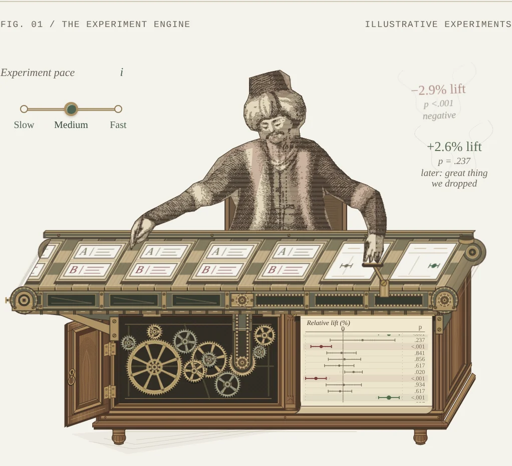
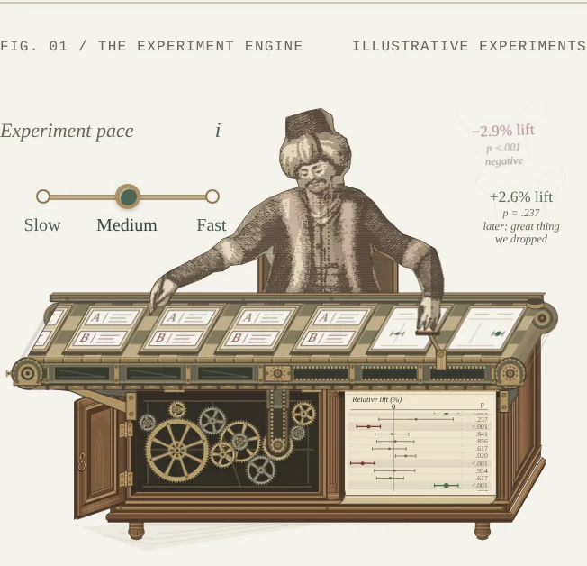
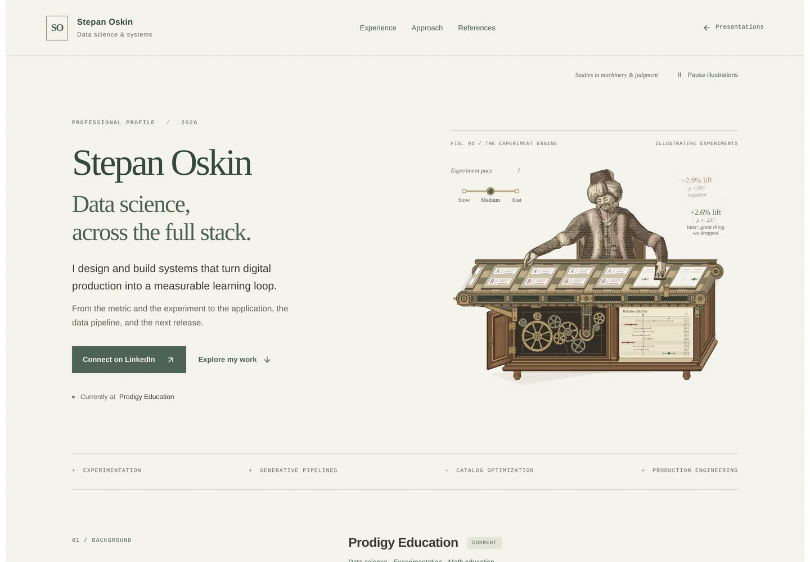
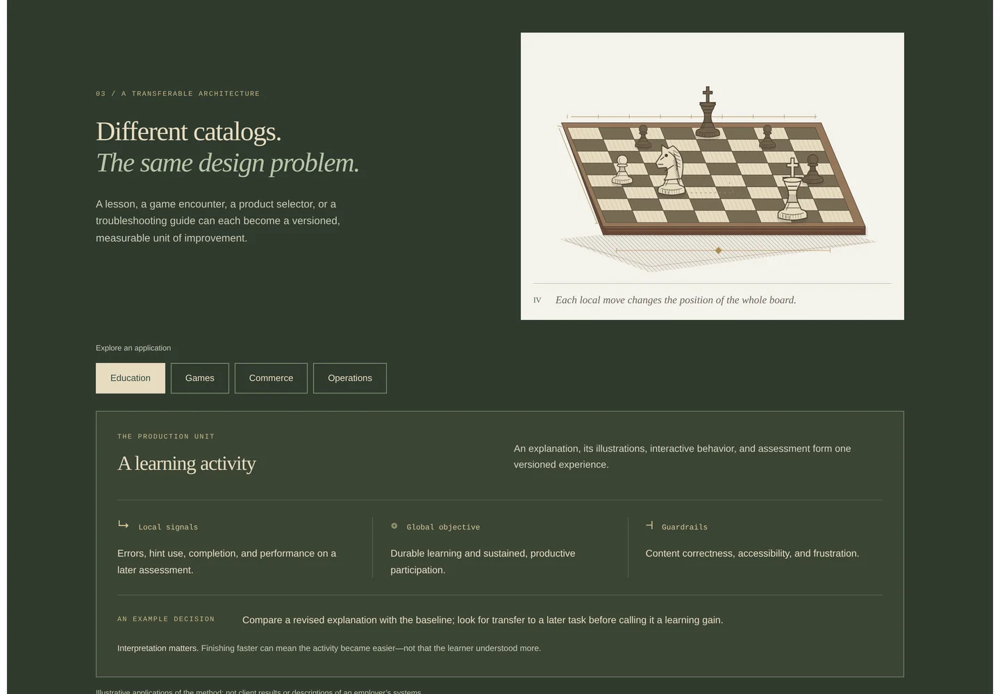

# Instrument finish, evidence and green palette — verification

4 October 2026 · `/stepanoskin/production-systems`

## Result

The accepted opening is the quality standard in design guidelines v1.8. Muted
deep green now leads headings, links, navigation, primary actions, figure numbers
and selected controls; warm charcoal, paper, ivory and an olive-green application
section extend the machine's material family through the page. The remaining
seven scene compositions still await their own focused polish passes.

The conveyor's bed and rear bearings share the cabinet's depth vector. A thin
rail cap, contact shadow and moving slat end faces add depth while retaining the
accepted brackets, drive connection, eleven gears and casework. Every emitted
result now has signed relative percentage lift, a p-value and a verdict. The
subtle green/red-brown lift color shows estimated direction, not significance or
a release recommendation. All examples and hindsight remain explicitly fictional.

Slow / Medium / Fast controls the entire mechanism. Medium is the default,
3 seconds per test (previously 2.4); Slow and Fast are approximately 4.36 and
2.18 seconds. No rate change seeks or resumes paused motion. A small sourced
explanation connects fixed-traffic sample size with precision and separates
multiple-testing policy from raw speed. Playback does not simulate accuracy or
FDR, and outcomes stay fixed. Public notes cite
[NIST sample-size guidance](https://www.itl.nist.gov/div898/handbook/prc/section2/prc222.htm)
and [Microsoft ExP on false-discovery control](https://www.microsoft.com/en-us/research/articles/treatment-effect-assessment-at-scale-accounting-for-correlated-metrics-and-metric-relevance-in-modern-experimentation/).

## Validation

- Required Lab CI: **46 suites / 202 tests**, asset integrity checks for seven
  retained releases, TypeScript and optimized production build passed. Focused
  ESLint and whitespace checks passed. An intermediate rerun timed out in the
  unchanged Pinterest assessment suite; a subsequent complete run passed with
  no test changes to that feature.
- Production Chromium at **320, 390, 768 and 1440 CSS pixels**: eight scenes,
  no overflow, duplicate IDs, console/page errors or reported axe A/AA /
  best-practice violations. Automated results are not a full accessibility audit.
- Native radio keyboard and phone touch selection pass. Medium is selected on
  load. The control has 44px-or-larger targets. Its disclosure links to both
  methodology sources and keeps the fixed-example limitation explicit.
- All **35** hero animations have the selected rate, with zero measured phase
  spread; changing speed while paused does not advance time. The chosen rate is
  restored after reduced-motion and print changes recreate animations. Reduced
  motion disables the selector and removes running animations. The pause
  preference, offscreen behavior and hidden-document unit tests remain passing.
- All **10** specimen/register/plume outcomes match. Belts move in opposite
  directions at matched rates; gear rotation agrees with nine sampled logical
  times. The default slowdown scales every motion together, preserving coupling.
  Text opacity is **0.96** at logical ages 240, 1000 and 2100 ms, corresponding
  to 300, 1250 and 2625 ms at Medium.
- No JavaScript leaves eight complete still scenes and hides inactive controls.
  Scenario keyboard/touch selection and source disclosure pass. Print remains
  **two A4 pages**. Returning from print retains the selected pace.
- Desktop opening, phone 390/320, the speed disclosure and the green application
  surface were visually inspected. The installed Playwright/Chromium harness is
  the equivalent fallback for the unavailable agent-browser CLI.

## Delivery observations

Unthrottled local production Chromium: cold LCP **1684 ms**, warm LCP
**732 ms**, CLS **0.000**. These are laboratory observations;
field and actual-device performance are unmeasured. Compressed HTML is
**297,033 bytes**, **+3,242 bytes** versus the accepted cabinet pass
(293,791 bytes). Encoded resource bodies total **297,201 bytes**; this is a
body-size observation, not a cached-transfer measure. Zero raster content-image
requests. No package, font, raster runtime asset or lockfile change.

The speed selector is a small client component inside server-rendered SVG
artwork. It performs one scheduled animation-rate update per selection or
preference change; no per-frame JavaScript was added. Historical references and
professional claims retain their existing scope. All colors are local to this
profile; Sanctuary, Loopforge and other brand apps are unchanged.

[Browser report](instrument-finish-browser-report.json) ·
[Speed, mechanics and result checks](instrument-finish-motion-report.json)

## Production captures

The opening and phone plates sample logical time 1.2 seconds; they show the
Medium selection and a readable negative/inconclusive result pair. Page captures
show the related green editorial and application palettes.

