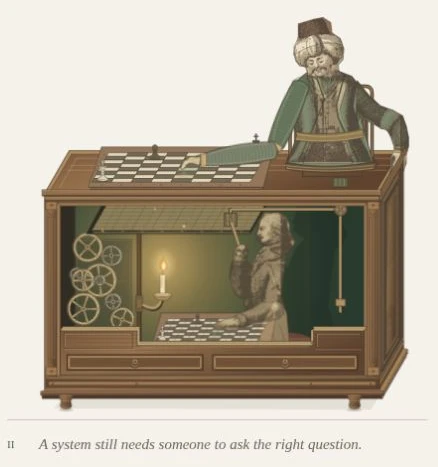

# Figure 2 — complete Turk, clockwork and case finish

5 October 2026. Scope: `/stepanoskin/production-systems#experience`, Figure 2.
This supersedes the current-visual claims of the earlier linked-move evidence;
those captures remain a record of that iteration. Figure 1 remains unchanged.

## Result

The formerly cropped automaton now has a complete turbaned head, engraved face,
waistcoat, outer robe and resting arm, supported by its existing chair and seat.
The playing shoulder retains its exact coordinates and the boards retain their
shared 12-second e2–e4 choreography. The lower operator remains concealed by the
finished wall section, with clear candle, controls and sightlines.

Nine meshing wheels replace the two-wheel sketch. Their pierced rims, tapered
spokes, fine hubs, alternating brass/steel and fixed light-facing bevels inherit
Figure 1's vocabulary. Seven rear gears and a compound foreground pair have
consistent tooth phases and speed ratios; recessed supports leave the train open.
The walnut case now has fluted posts, corner blocks, mitred rebates, grain that
follows each board, recessed return panels, drawer pulls and a stepped plinth.
Side mouldings use the same (+34.64, −60) depth vector as the cabinet.

## References actually inspected

- [HNF, twenty years of its reconstruction](https://blog.hnf.de/zwanzig-jahre-hnf-schachtuerke/):
  head study by Annette Seidel-Rohlf, seated exterior and costume, alongside the
  previously inspected working mechanism. Museum photography is reference-only;
  no museum photo is redistributed or fetched by the public page.
- [HNF reconstruction](https://www.hnf.de/en/permanent-exhibition/exhibition-areas/the-mechanization-of-information-technology/early-automatons-miracles-of-technology/the-reconstruction-of-the-hnfs-chess-turk.html):
  distinguishes the reconstruction and uncertainty about original construction.
- [Racknitz's 1789 plate III](https://commons.wikimedia.org/wiki/File:Racknitz_-_The_Turk_3.jpg):
  existing, credited public-domain source of the procedural figure incisions.
  HNF's corrections to its scale and operator layout remain explicit.

These inform an editorial interpretation, not a restoration or exact blueprint.
The original candlelight and simplified controls retain that distinction.

## Validation

- Required Lab CI: asset checks, **51 Jest suites / 226 tests**, optimized Next.js
  build, application TypeScript validation and all 55 static pages completed.
- Scoped ESLint and `git diff --check`: no findings.
- Two new geometry tests verify bay bounds, non-mating tooth clearances, every
  mesh's centre spacing, opposite surface speeds, tooth phase through time and
  the compound arbor. Existing linked-board and light/shadow tests still pass.
- Production-build browser review at 1440×1000, 768×1000, 390×844 and 320×844:
  no horizontal overflow; complete head, cabinet feet and caption fit; both boards,
  candle and operator remain visible. The taller SVG uses `0 -172 600 592`.
- Pause freezes all 31 local animated groups across successive observations;
  keyboard Enter resumes. Navigating to References pauses every offscreen group;
  returning to Experience resumes them. Nine distinct gear groups and their
  intended 10–48-second periods are present.
- No console errors, duplicate SVG IDs, broken `use` targets, filters, raster
  images or canvas elements in the revised figure.

## Cost and limits

Figure 2 contains **1,003 SVG descendants and 31 animated groups**, compared with
693 / 24 before this pass. The added moving parts are seven gear transforms.
All new components are server-rendered; no client boundary, dependency, observer,
per-frame JavaScript, external image request or animation controller was added.
Visible source scan lines are selected once on the server. Existing profile
pause, document visibility and reduced-motion handling retain authority.

The complete static page is 1,920,617 bytes, **426,986 bytes at gzip level 6**
(previous 374,897 gzip): the additional engraved figure detail costs about 52 KB
compressed. These are artifact sizes, not measured transfer or field performance.
OS-level reduced-motion/print emulation, full axe, device FPS and field Core Web
Vitals were not rerun; existing lifecycle tests passed. No new performance claim
is made beyond the measured structure and verified lifecycle.

## Captures

- [Desktop context](operator-complete-desktop.webp)
- [Figure detail](operator-complete-detail.webp)
- [390px phone](operator-complete-390.webp)
- [Browser report](operator-complete-browser-report.json)

