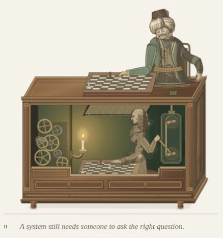

# Figure 2 — an attached control chain

5 October 2026. Scope: `/stepanoskin/production-systems#experience`, Figure 2.
The proportion pass remains; this replaces its loose roof rod and barely moving
control with a far-wall mechanism to the operator's right.

## Result

Four screws fix a shallow green-and-brass backplate to the far wall. Two equal
cranks share a rigid coupling rod; bearing collars support the output shaft as
it enters the Turk's seat. The lower handle has a dark wooden grip. Every visible
rod ends at a pivot, collar or cabinet penetration.

The operator's articulated control arm now keeps a wrapped hand on that grip.
A 28-degree pull begins with the move, continues through lift/travel, holds through
placement and returns with hand withdrawal. The hand travels about 20 units left
and down, making the pull legible at reading size. The original raised source arm
is clipped out; the new arm also appears in the moving candle shadow.

The human's board hand and the Turk repeat the same e2–e4 move. Both cranks, rod,
grip, elbow and wrist derive from a single geometry model and the shared 12-second
phase. The apparatus is an original interpretive mechanism, not a historical
blueprint; the [previous source record](operator-complete-verification.md) remains.
Design guidelines v2.4 document the control and attachment rules.

## Verification

- Required Lab CI passed asset checks, **51 Jest suites / 229 tests**, application
  TypeScript, optimized build and all 55 static pages.
- Scoped ESLint and `git diff --check` pass.
- New geometry checks cover constant crank radii, constant rod length, attached
  rod endpoints, two rigid arm segments, hand/grip contact and pull/hold/return
  timing. Existing board, gear and lighting tests pass.
- Production-build browser review at 1440×1000, 768×1024, 390×844 and 320×844:
  no horizontal overflow; handle, arm, mounted frame, shaft, candle and both boards
  remain visible. Distinct observed grip positions show actual pull during pawn
  movement; both cranks have matching transforms.
- All 35 local animation groups pause, with stable transforms between samples;
  keyboard Enter resumes. Offscreen navigation suspends all 35 and return resumes.
- No console errors, duplicate SVG IDs or unresolved SVG `use` targets.

## Cost and limits

Figure 2 contains **1,066 SVG descendants / 35 animated groups**, versus 1,005 / 31.
Four extra groups articulate the visible control arm and its shared silhouette.
No new client component, dependency, observer, per-frame JavaScript or filter.
The initial server render remains complete; the existing reduced-motion and
page-visibility lifecycle retains authority.

Complete page HTML: **1,969,830 bytes / 434,915 bytes at gzip level 6**; about
6.9 KB compressed above the proportion pass. These are build artifact sizes,
not network or field performance measurements. OS reduced-motion/print emulation,
full axe, device FPS and field Core Web Vitals were not rerun; lifecycle tests pass.

## Captures

- [Desktop context](operator-control-desktop.webp)
- [Figure detail](operator-control-detail.webp)
- [390px phone](operator-control-390.webp)
- [Browser report](operator-control-browser-report.json)

