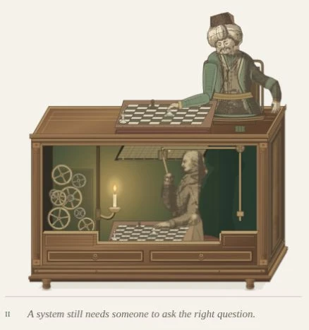

# Figure 2 — seated proportions and a reachable board

5 October 2026. Scope: `/stepanoskin/production-systems#experience`, Figure 2.
This supersedes the current-visual claims of the complete-Turk evidence, retained
as a record of that iteration. Figure 1 is unchanged.

## Result

The upper chessboard is about 25% narrower and moves toward the seated Turk.
The shoulder now sits at (416, −48); upper arm and forearm measure 68 and 62 scene
units. Their combined length falls from 210 to 130, preserving an elbow bend
through the entire move. The hand scales to 0.8 and its wrist connection is
included in the reach calculation. The resting arm is 20% smaller.

A narrower waist, shaped belt and curved lap give the robe a seated silhouette.
Tapered sleeves have long cloth folds and gathered elbow creases. The engraved
head, existing candlelit operator, cabinet and nine-wheel mechanism remain.
Both eight-by-eight boards retain the shared 12-second e2–e4 demonstration.
The underside indicator board now derives every square and frame edge from
the upper board, with a fixed 69-unit vertical offset.

This is an editorial proportion correction to the existing historical studies,
not a new claim about the original machine. The [complete-Turk evidence](operator-complete-verification.md)
records the inspected HNF and Racknitz sources.

## Validation

- Required Lab CI: asset checks, **51 Jest suites / 227 tests**, optimized Next.js
  build, application TypeScript and all 55 static pages completed.
- Scoped ESLint and `git diff --check`: no findings.
- Geometry tests verify rigid arm attachment, reachable wrist throughout the
  gesture, a relaxed bend, hand contact, legal shared move and all 64 vertically
  aligned upper-board indicators. Existing clockwork and lighting checks pass.
- Production browser review at 1440×1000, 768×1024, 390×844 and 320×844:
  no horizontal overflow; complete figure, board, operator, candle and caption fit.
- Pause freezes all 31 local animated groups and their sampled transforms;
  keyboard activation resumes. References navigation suspends offscreen motion;
  Experience navigation resumes all 31 groups.
- No console errors, duplicate SVG IDs, unresolved `use` references, filters,
  raster images or canvas elements in Figure 2.

## Cost and limits

Figure 2 contains **1,005 SVG descendants and 31 animated groups** (previous
1,003 / 31). No additional animated group, client boundary, runtime dependency,
observer, per-frame JavaScript or image request was introduced. Geometry is
sampled on the server; the existing pause and visibility controller remains.

Complete static HTML: **1,921,156 bytes / 428,035 bytes at gzip level 6**,
compared with 426,986 compressed previously: about 1 KB additional compressed
markup. These are artifact sizes, not field transfer or performance measurements.
OS-level reduced motion, print, full axe, device FPS and field Core Web Vitals
were not rerun for this geometry pass; existing lifecycle tests pass.

## Captures

- [Desktop context](operator-proportions-desktop.webp)
- [Figure detail](operator-proportions-detail.webp)
- [390px phone](operator-proportions-390.webp)
- [Browser report](operator-proportions-browser-report.json)

