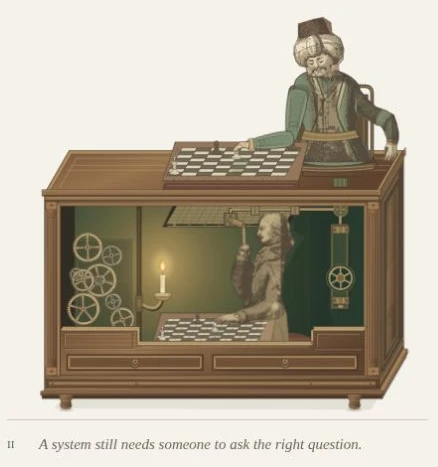

# Figure 2 — restore the approved operator and forward lever

5 October 2026. The owner rejected the backward-reaching arm introduced in the
previous control pass. Its successful automated checks did not make its pose
acceptable. This correction restores the source operator and lever position from
`62cc92e` and confines the machinery change to the downstream connection.

## Correction

The original raised source arm, clipping, body placement and silhouette are
restored verbatim. The forward grip remains at (334, 182), with elbow/lever pivot
at (340, 244). No replacement arm reaches behind the person. The original hand
and lever share one 14-degree rotation toward the body through lift and travel,
hold through placement and return with the chess hand's withdrawal.

A rigid 38-unit link meets a 20-unit rocker under the roof at (319, 136).
The downstream shaft has roof supports, narrow recessed far-wall mountings,
bearing collars, a small open wheel and a terminal cap. It connects upward into
the Turk's seat. The right-side mechanism is subordinate to the operator and
does not relocate his working hand. Both boards retain the synchronized e2–e4
move. This remains an original illustrative mechanism, not a historical blueprint.

Guidelines v2.5 record the owner's explicit correction; the previous evidence is
marked rejected so it cannot be mistaken for the design benchmark.

## Validation

- Required Lab CI: **51 Jest suites / 229 tests**, asset checks, application
  TypeScript, optimized build and all 55 static pages pass. Scoped ESLint and
  `git diff --check` pass.
- Tests check the preserved grip/pivot, rigid rod and rocker lengths, attached
  rod endpoints, forward-side hand clearance and pull/hold/return timing.
  Existing board, gear and light checks pass.
- Render inspected at 1440×1000, 768×1024, 390×844 and 320×844. Rest and full-pull
  frames were checked against the earlier operator composition. The hand remains
  in front of the face, the candle stays clear and there is no page overflow.
- Observed lever transforms match between the hand, lever and shadow. Pause holds
  all 32 animated groups and sampled transforms; keyboard Enter resumes. The
  offscreen scene suspends all groups and resumes on return.
- No console errors, duplicate SVG IDs or unresolved `use` targets.

## Cost and limits

**1,050 SVG descendants / 32 animated groups**: one extra animated roof rocker
relative to the original proportion pass. The rejected replacement arm is gone.
No new client component, dependency, observer, filter or per-frame JavaScript.
HTML is **1,937,810 bytes / 429,852 bytes at gzip level 6**, about 1.8 KB above
the accepted proportion version and smaller than the rejected control pass.
These are build artifact sizes, not field performance measurements.
OS reduced-motion/print emulation, full axe, device FPS and field Core Web Vitals
were not rerun. Existing lifecycle tests pass. Owner acceptance remains pending.

## Captures

- [Desktop context](operator-restored-desktop.webp)
- [Figure detail](operator-restored-detail.webp)
- [390px phone](operator-restored-390.webp)
- [Browser report](operator-restored-browser-report.json)
- [Earlier operator composition](operator-proportions-detail.webp)

