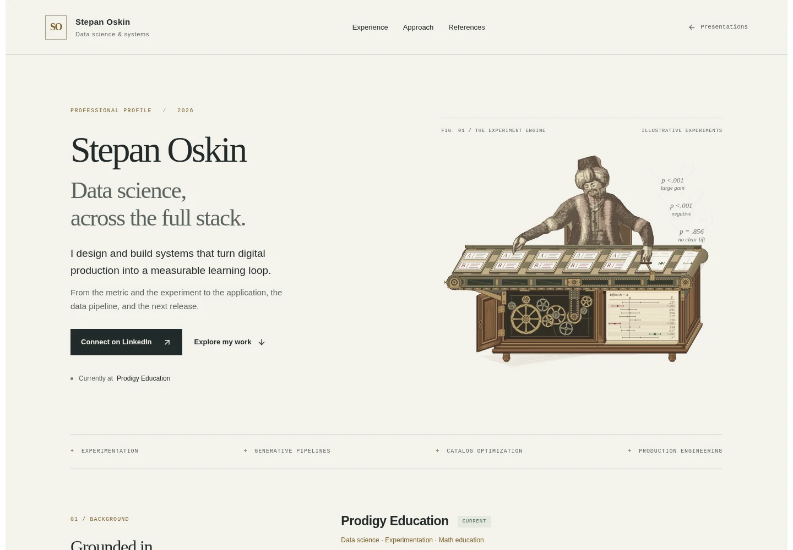
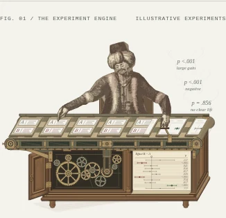
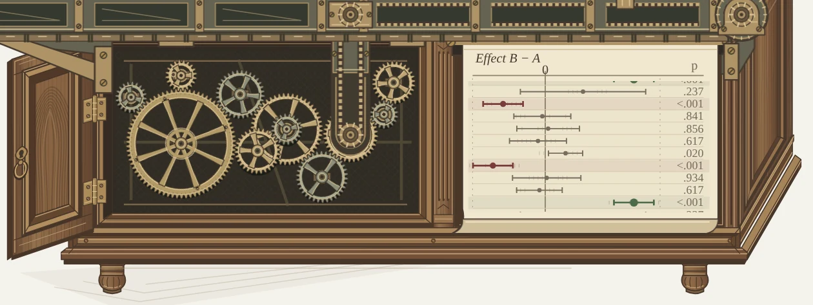

# Cabinet finish — verification

4 October 2026 · `/stepanoskin/production-systems`

## Visual result and reference

A finely joined walnut cabinet now encloses the accepted machine: a restrained
cornice, rebated opening, fluted center stile, shaped apron and stepped plinth,
short turned feet, and a paneled door with thickness, two pin hinges and a pull.
Thin pale stringing, miter seams, long fibres and nested grain incisions add
material detail. The shadowed interior continues to expose all eleven gears.

[Windisch's 1783 engraving](https://commons.wikimedia.org/wiki/File:Tuerkischer_schachspieler_windisch4.jpg)
was inspected in the browser for projecting edges, framed compartments and door
depth. Our casework is an original procedural interpretation. No new historical
claim, source raster or public caption was introduced. Existing artwork credits
remain applicable; design guidelines and the reference sheet document the pass.

## Construction and boundaries

- The right side uses the conveyor's (+36.95, −64) depth vector. Each base profile
  returns continuously around the corner. Thin bevels and recesses stay distinct
  at phone scale; finer engraved texture is a close-inspection reward.
- The door is drawn in front of the base, with a visible edge and small hinges
  attached to the fixed jamb. Its upper hinge begins at y=389, below the conveyor
  mounting bracket (ending at y=386); the door does not carry the conveyor.
- The mechanical chamber remains x=158–369, y=354–469. All eleven wheels, rear
  bearings, foreground reduction and (322, 415) takeoff remain exposed. Conveyor
  brackets, chains, paper register, figure, stamp and smoke retain their behavior.
- Geometry is deterministic server-rendered SVG. Long-grain and figured-grain
  strokes are batched patterns, and the casework is static. There is no new
  animation, client component, font, raster request, package or lockfile change.
- Only the professional-profile illustration and its Lab design/evidence notes
  are changed. The seven later scenes, page layout, claims and other apps retain
  their existing implementation.

## Validation

- Required Lab CI passed: **45 suites / 195 tests**, asset checks for four retained
  releases, TypeScript and optimized production build. Focused ESLint and whitespace
  checks passed. Existing tests cover gear geometry/coupling and the lifecycle's
  hidden-document, offscreen, manual-pause and reduced-motion behavior.
- Production Chromium at **320, 390, 768 and 1440 CSS pixels**, DPR 1: eight scenes,
  no overflow, duplicate IDs, page/console errors or reported axe A/AA / best-practice
  violations. These automated results are not a full accessibility certification.
- Keyboard pause/resume, pause persistence after reload, offscreen suspension,
  reduced motion, keyboard and touch scenario selection, and source disclosure
  passed. No-JS preserves all eight scenes and hides the inactive motion control.
  The existing compact print layout remains two A4 pages.
- Gear samples from 0 to 24 seconds agree with each wheel's speed and direction.
  All **34** hero animations stop under pause; reduced motion has zero running
  animations. All **10** outcomes match between specimen, paper row and smoke.
  Upper and return belts move in opposite directions at the same rate. Smoke
  opacity remains **0.96** at 240, 1000 and 2100 ms before dissolving.
- The complete opening, enlarged cabinet, phone still and representative stamping
  and smoke poses were visually inspected. Both door hinges now clear the conveyor.
  Equivalent installed Playwright/Chromium verification was used because the
  agent-browser CLI is unavailable in this environment.

## Delivery observations

Unthrottled local production Chromium: cold LCP **1344 ms**, warm LCP
**600 ms**, CLS **0.000**. These are laboratory observations;
field and actual-device performance remain unmeasured. Compressed HTML is
**293,791 bytes**, a **+4,009-byte** (+1.4%) change from the
accepted clockwork's 289,782 bytes. Zero raster content-image requests. Encoded
resource bodies total **295,795 bytes**;
this is a body-size observation, not a cached-transfer measurement.

[Browser report](turk-cabinet-browser-report.json) ·
[Casework, gears and conveyor checks](turk-cabinet-motion-report.json)

## Production captures

Desktop and phone show complete reduced-motion stills. The cabinet close-up
samples motion at 1.2 seconds and includes the fixed conveyor mounting points.

