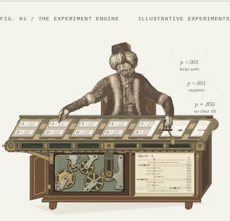
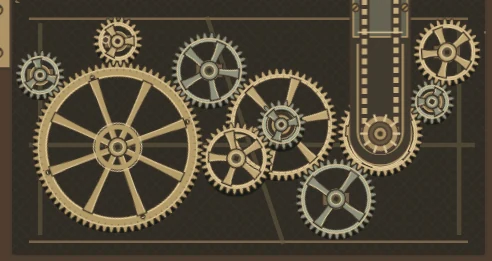

# Open clockwork cabinet — verification

4 October 2026 · `/stepanoskin/production-systems` · revised PR #68

## Scope and visual direction

The cabinet has eleven exposed gears, with a dominant eight-spoke flywheel,
small quick pinions, medium wheels and an overlapping foreground reduction.
Narrow rear bearings support the arbors. Broad watch bridges, patterned silver
plates, jewel settings and front braces are removed. Brass and dark steel rims,
pierced spokes and a dark engraved recess keep the machinery legible.

This implements the owner’s correction: precision should be conveyed by the
open mechanism and varied motion, with less literal watch architecture. The
[finishing reference](https://www.patek.com/en/manufacture/artisans-of-time/hand-finishing)
now informs small rim and hub details only. The composition is original; the
live page no longer presents a specific watch caliber as its layout reference.
The Turk, accepted conveyor, register and result emissions retain their behavior.

## Construction and motion

- **Eleven wheels**, from **18 to 74 teeth** (pitch radii 9–37). The large
  flywheel takes approximately **6.17 seconds** per turn; the smallest relay
  pinion takes **1.5 seconds**. Both rotation directions are visible.
- A five-wheel main train supplies the conveyor. Four branch wheels mesh with
  it. A foreground pinion shares the centre wheel’s arbor and drives a separate
  reduction, with a visible spacer between planes. Open spokes show deeper parts.
- Common module-one teeth, tangent pitch circles, phased contacts and matched
  pitch-line velocities apply to every mesh. Same-plane non-mating wheels clear
  each other; all tooth tips fit inside the chamber. Compound wheels share
  position and angular speed. Overlap occurs between distinct physical planes.
- Output remains **(322, 415)** and **288° clockwise per 2.4 seconds**. The small
  collar, front sprocket, vertical chain, jackshaft and upper chain form the
  same visible connection to the conveyor. No conveying or stamping speed changes.
- Nine browser samples from 0 to 24 seconds agree with each wheel’s intended
  rotation, including the output’s 3-second revolution boundary. All **34** hero
  animations pause together; reduced motion has zero running animations and
  retains all eleven wheels.
- All ten specimens match the arriving register row and smoke verdict. Belt and
  return still travel equally in opposite directions. Smoke opacity is 0.96 at
  240, 1000 and 2100 ms, then dissolves. These remain synthetic outcome examples.

## Validation

- Required Lab CI: **45 suites / 195 tests**, asset pipeline checks, four retained
  releases, TypeScript and optimized production build passed. Three movement
  tests cover case/mesh clearance, tooth phase and speed through every branch,
  compound-arbor coupling, and the conveyor output. Focused ESLint and whitespace
  checks passed. No dependency, lockfile or shared runtime changes.
- Production Chromium at **320, 390, 768 and 1440 CSS px**, DPR 1: eight scenes,
  no horizontal overflow, duplicate IDs, browser errors or reported axe A/AA /
  best-practice violations. Automated checks do not establish full conformance.
- Keyboard pause/resume and persistence, offscreen suspension, reduced motion,
  keyboard/touch scenario selection, source disclosure, no-JS stills and print
  checked. No-JS retains eight complete scenes and hides the inactive control.
- Visual review covers the complete opening, enlarged movement, phone still,
  stamping and smoke poses. Current captures below supersede the earlier broad
  watch-bridge treatment.
- React review: deterministic server-rendered geometry, existing motion lifecycle,
  no per-frame JS, new client boundary, raster asset, font or dependency. The
  installed Playwright/Chromium harness provides equivalent verification because
  agent-browser CLI is unavailable locally.

## Delivery observations

Unthrottled local production Chromium: cold LCP **1996 ms**, warm LCP
**324 ms**, CLS **0.000**. These are laboratory observations;
actual-phone and field performance are unmeasured. Compressed document
**289,782 bytes** (+23,100, 8.7% from the accepted conveyor’s
266,682). The geometry now contains eleven open wheels and two planes. Zero
raster content-image requests. Encoded resource bodies total **295,795 bytes**;
this is a body-size observation, not a cached-transfer measurement.

[Browser report](turk-clockwork-browser-report.json) ·
[Wheel phases and lifecycle](turk-clockwork-motion.json) ·
[Conveyor and outcome regression](turk-clockwork-conveyor-regression.json)

## Production captures

Desktop and phone show reduced-motion stills; detail samples motion at 1.2 s.

