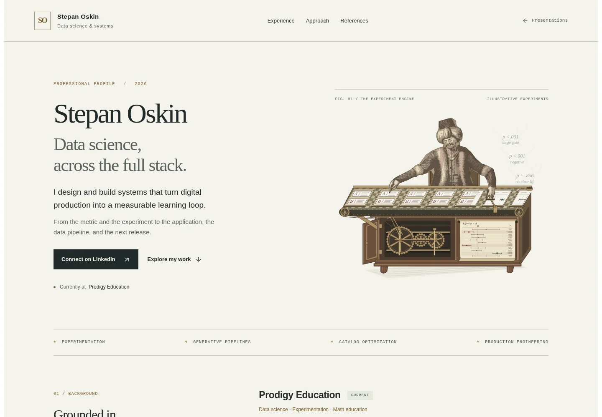
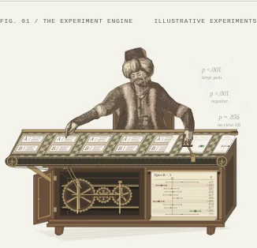
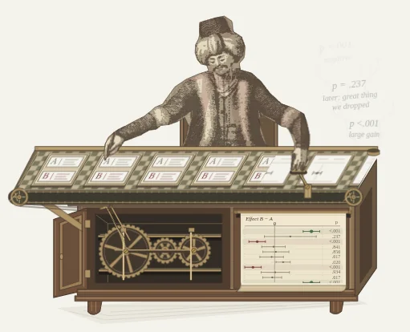

# Continuous Turk conveyor — verification

3 October 2026 · `/stepanoskin/production-systems` · follow-up to merged PR #60

## Visual changes

The source-derived figure now sits behind the work surface. Chair, torso and lap
are occluded by the tabletop; only the forearms and hands cross the belt. The
conveyor runs continuously, with a brisk stamp every 2.4 seconds: 216 ms strike,
96 ms contact, 384 ms return. Its paper register advances with each outgoing test.
Subtle gray, red and green marks/washes align with uncertain, negative and positive
outcomes. The established plots, paper roll and engraved cabinet remain intact.

P-values and verdicts rise from the outfeed as pale gray smoke. At most three
emissions are active, with fictional hindsight prefixed “later.” All text below
the opening SVG has been removed. Synthetic-data context remains in the plate
header, accessible description and existing public artwork/methodology notes.
No new professional claims, runtime dependencies, image requests or client code.

## Verification

- Required `API_BASE_URL=http://localhost:8000 npm run ci` passed at the default
  settings: asset integrity, **42 suites / 185 tests**, retained asset releases,
  TypeScript and production build. Scoped ESLint and whitespace checks passed.
- Production Chromium: **320, 390, 768 and 1440 CSS px**, DPR 1; eight scenes,
  no horizontal overflow, duplicate IDs, browser errors or reported axe A/AA and
  best-practice violations. Automated checks do not establish full conformance.
- All ten outcomes were checked at their outfeed instant: the departing specimen,
  arriving plot row and newly emitted smoke share the same outcome. Rows use the
  corresponding muted result color. The paper advances 8.5 SVG units per test.
- Motion phases inspected at 0, 1.8, 2.28 and 3 seconds. Belt motion is linear,
  88 SVG units per 2.4 seconds; the result/register cycle repeats every 24 seconds.
  Captures at 23.999 and 24 seconds differ by more than 16 RGB levels at only
  **98 / 211,554 pixels (0.046%)**, on fine moving edges.
  The specimen and paper sequences repeat without a content jump.
- Keyboard pause/resume, persistent preference, offscreen suspension and OS
  reduced motion passed. All 20 hero animations pause together; reduced motion
  leaves three composed still plumes and no running animations.
- Keyboard and touch scenario selection, artwork source disclosure and no-JS
  reading passed. All eight plates remain present without JavaScript; the inactive
  motion control is hidden. A4 print remains **two pages**.
- One initial local check lacked the required runtime API setting and produced a
  route-prefetch error. After correcting the check environment, the full browser
  verification above completed without errors. No app change was required.

## Delivery observations

Unthrottled local production Chromium: cold LCP **1156 ms**, warm LCP
**284 ms**, CLS **0.000**. Field performance is unmeasured.
The compressed document is **262,079 bytes**, including SVG/React
payloads (PR #60: 260,201 bytes). Zero raster content-image requests, no new fonts
or rendering loop. Cold encoded resource bodies total
**295,719 bytes**; this is a body-size observation,
not a cached network-transfer claim.

Raw reports: [browser checks](turk-continuous-browser-report.json),
[motion and synchronized outcomes](turk-continuous-motion-phases.json).

## Production captures

Desktop and phone show the reduced-motion composition; the close view samples
normal motion at three seconds.

