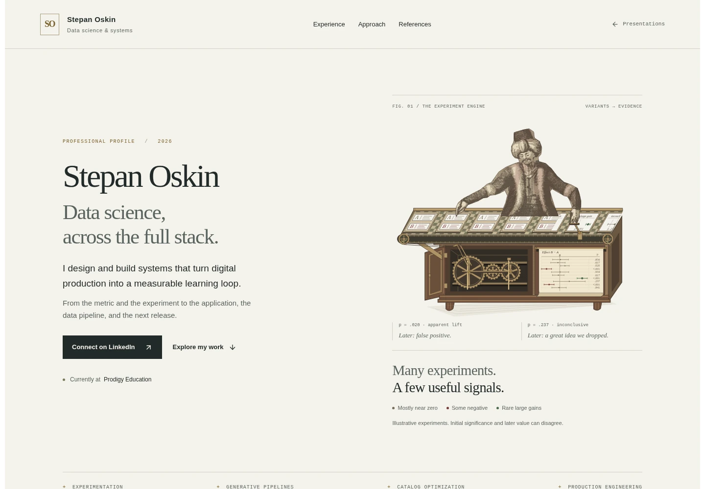
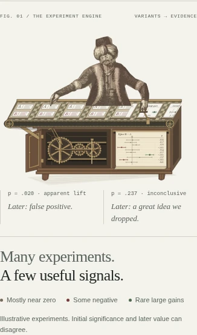
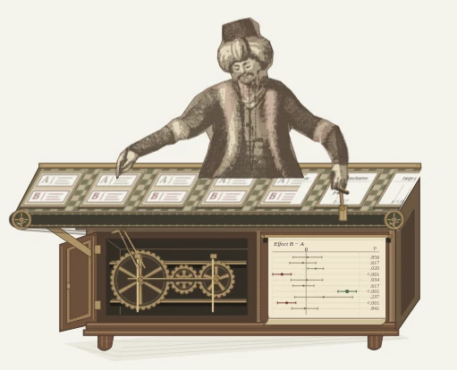

# Mechanical Turk experiment conveyor — verification

3 October 2026 · `/stepanoskin/production-systems`

## Scope and visual review

The opening plate now depicts the recognizable seated Turk pushing an indexed
A/B conveyor built into its cabinet. Paired specimens become effect estimates on
the outfeed. A paper register presents mostly near-zero estimates, variable
uncertainty, two losses and a rare large gain. Muted p-values and marginal notes
separate initial evidence from hindsight: a false positive and a valuable idea
that was dropped too early. Later section scenes remain for subsequent passes.

Reviewed the real Windisch exterior and Racknitz III source plates, alongside
the existing Sanctuary composition reference. The figure remains source-derived
vector geometry; casework, conveyor, register and motion are original. Source
credits and the synthetic-data explanation are available on the public page.

## Validation

- Asset integrity test and all four retained release checks passed.
- Full test suite: **42 suites / 185 tests passed**, with the required API setting,
  serial execution and a 15-second per-test allowance. The default final CI run
  hit the existing Pinterest interaction suite's 5-second timeouts; no test code
  or repository timeout configuration was changed. The earlier full CI run also
  passed at the default timeout before the additional outcome artwork.
- Final production build, including TypeScript, passed. Scoped ESLint and
  `git diff --check` passed. No runtime packages or client scripts were added.
- All ten synthetic approximate 95% intervals and two-sided p-values were
  independently checked against the stated normal model. The mixture is
  illustrative, not an empirical rate. Fictional hindsight is authored separately
  from those statistics; it is not inferred from significance.
- Chromium production review at **320, 390, 768 and 1440 CSS px**, DPR 1:
  eight scenes, no horizontal overflow, duplicate IDs, browser errors or reported
  axe WCAG A/AA / best-practice violations. This automated check does not establish
  complete accessibility conformance.
- Keyboard pause/resume, persistent manual preference, offscreen suspension,
  reduced motion (zero running animations), application radio keyboard navigation,
  mobile touch selection and visible artwork credits passed.
- No JavaScript retains all eight complete still plates and readable profile;
  the inactive motion control is hidden. A4 print remains **two pages**.
- Rest, push and return poses were inspected. Input and result tracks both advance
  88 SVG units per 8-second stroke. The ten-outcome sequence repeats every 80
  seconds. End/start captures differ materially at 177 of 211,554 pixels (0.084%),
  confined to fine rotational edge rendering; specimens and their result labels
  repeat continuously. The sleeve overlaps the moving forearm without an open seam.

## Delivery observations

Unthrottled local production Chromium measurements on this development host:
cold LCP **936 ms**, warm LCP **208 ms**, CLS **0.000**. Field performance is
unmeasured. The compressed document is **260,201 bytes**, including all inline
SVG/React payloads (previous scene pass: approximately 183 KB). The additional
source-derived figure and result geometry account for this measured tradeoff.
There are **zero raster content-image requests**, no new font downloads, and no
new client-side rendering loop. Cold encoded resource bodies total **295,842
bytes**; this is a body-size observation, not a cached network-transfer claim.

Raw reports: [browser checks](turk-conveyor-browser-report.json) and
[motion phases](turk-conveyor-motion-phases.json).

## Captures from the production build

