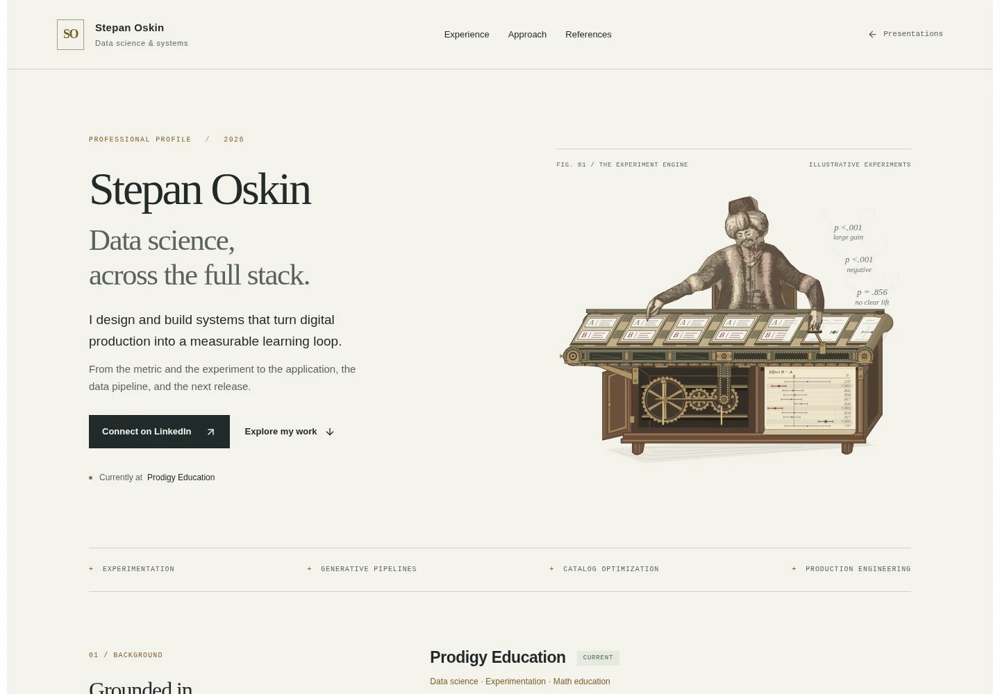
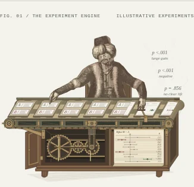
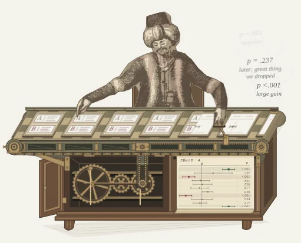

# Conveyor assembly and readable verdicts — verification

4 October 2026 · `/stepanoskin/production-systems`

## Scope and construction review

The conveyor now has jointed checker-inlaid slats, matching end-drum depth, a
reverse lower return, stationary rails, split bearing blocks, a slotted tail
adjustment, a tension screw, bracing and bolted mounts. Mounts land on the fixed
cabinet jambs, clear of the open door and moving paper register.

The existing cabinet shaft connects through a vertical chain to a compound
jackshaft, then through a second chain to the right drum. The upper chain is
visible through three inspection openings. The original cabinet interior itself
is reserved for the next pass. Source-derived figure, fast hand gesture,
synthetic outcomes, moving plots and the caption-free opening remain.

Loopforge’s approved factory stage supplied a light reference for substantial
frame members, recessed inspection openings and purposeful fasteners. Contemporary
functional reference: [Dorner 2200 end-drive manual, Rev. J](https://www.dornerconveyors.com/wp-content/uploads/2017/09/851-452j.pdf),
component relationships on p. 5 and mounting/return/bearing sections. Its source
is linked in the public artwork disclosure. This is an original engraved
interpretation in wood, iron and brass; no manufacturer diagram was copied.

## Motion and readability

- Top and return sampled at 0/600/1200/1800/2400 ms: respective translations
  **0/22/44/66/0** and **0/−22/−44/−66/0** SVG units. Their repeated patterns
  wrap seamlessly; stationary rails and bearing housings do not move.
- Cabinet takeoff, compound shaft and drum rotate 288 degrees per 2.4 seconds.
  Effective drum pitch radius 17.507 gives 88 units of belt travel; ten-tooth
  radius-seven chain sprockets advance eight links per interval. The source
  defines this dimensional relationship; the browser verifies the motion phases.
- All ten outcomes match across outgoing specimen, arriving plot row and smoke.
- Emission opacity is **0.96 at 240, 1000 and 2100 ms**, **0.73 at 4000 ms**,
  and **0.06 at 6500 ms**. Lettering is darker and slightly larger; wisps remain
  faint. Still/reduced-motion labels also use stronger contrast.
- Rest, strike, return and rising-smoke poses were visually inspected. The
  23.999/24-second boundary differs by more than 16 RGB levels at only
  **158/211,554 pixels (0.075%)**, confined to fine moving edges.

## Validation

- Required CI passed: asset pipeline tests, **43 suites / 191 tests**, four
  retained asset releases, TypeScript and production build. The final adjustment
  seating mounts on the jambs received another production build and scoped lint.
  `git diff --check` passed. No dependency manifest or lockfile changed.
- Production Chromium at **320, 390, 768 and 1440 CSS px**, DPR 1: eight scenes,
  no horizontal overflow, duplicate IDs, console errors or reported axe A/AA /
  best-practice violations. Automated checks do not establish full conformance.
- Keyboard pause/resume and persistence, offscreen suspension, reduced motion
  (zero running animations), keyboard/touch scenario selection and source
  disclosure passed. No JavaScript retains eight complete still plates and
  hides the inactive motion control. A4 print remains **two pages**.
- React review: isolated server component, deterministic rounded geometry,
  existing visibility/preference controller, no client state/render loop or
  dependency addition. Small CSS chain paths add dash-offset animation; all
  **26** hero animations share pause/reduced-motion behavior.
- The requested verification CLI was unavailable locally. Equivalent checks and
  captures used the installed Playwright/Chromium harness.

## Delivery observations

Unthrottled local production Chromium: cold LCP **1036 ms**, warm LCP
**328 ms**, CLS **0.000**. Actual-phone and field performance
are unmeasured. Compressed document **266,682 bytes** (PR #62:
262,079 bytes); zero raster content-image requests or added fonts. Cold encoded
resource bodies total **295,785 bytes**, a body-size
observation rather than a cached network-transfer measurement.

[Browser report](turk-mechanics-browser-report.json) ·
[Motion, drive phases and emission opacity](turk-mechanics-motion-phases.json)

## Production captures

Desktop/phone show the still composition; assembly samples normal motion at 3 s.

