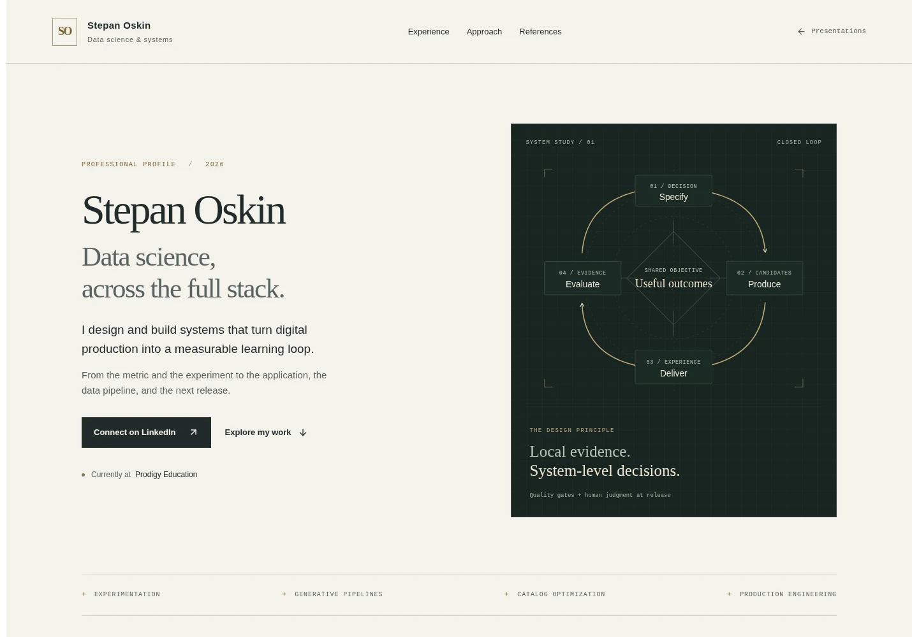
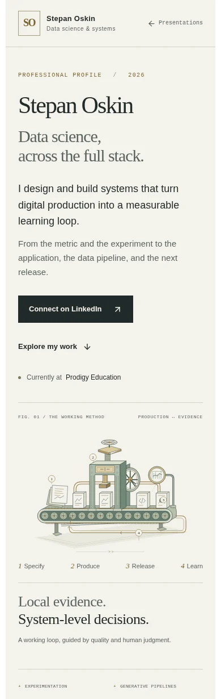

# Stepan Oskin — production systems profile

## Brief and plan · 3 October 2026

Add `/stepanoskin/production-systems` as another presentation in the existing
`/stepanoskin` menu on `https://www.fruitfulab.net`. Scope: `apps/lab` and route
documentation only. Other apps, backend contracts, Sanctuary, and ongoing
Loopforge work are outside this change. Branch: `codex/professional-systems-profile`.

Audience: technical hiring managers, founders, and product leaders assessing
data-science judgment and full-stack implementation capability. The owner
confirmed current work at Prodigy Education, building in-house production
experimentation over a substantial math-education catalog with concurrent
item-level tests and custom success metrics. Keep this abstract. Do not publish
internal architecture, catalog details, metric definitions, or performance results.
Do not invent job dates, formal titles, employers, credentials, or client outcomes.

Sequence: professional identity and original loop diagram; current role and public
work; capabilities across measurement, generation, implementation, and operations;
an interactive comparison of four application domains; experimental method;
production process; primary sources and LinkedIn/print actions.

Visual direction: warm paper, graphite, restrained brass, SO monogram, and an engraved
production apparatus on the same paper surface. No ambient motion, sound, image generation, or new fonts. This
follows the shared design/performance instructions provided from the main checkout.
Server-render the document. Limit client JavaScript to the scenario comparison and
profile actions. Preserve keyboard navigation, 44px controls, visible focus, English
language semantics, and a readable print layout.

## Research and boundaries

Checked 3 October 2026:
- LinkedIn: https://ca.linkedin.com/in/stepan-oskin-871b8a65
  Search-indexed public profile matches name and employer. Direct fetch was rate
  limited. The owner confirmed the current role; older profile material is not
  assumed current and no historical job titles/dates were imported.
- Publication: https://www.jtlu.org/index.php/jtlu/article/view/1905
  Publisher confirms Raghav, Oskin and Miller (2022), DOI 10.5198/jtlu.2022.1905.
- Google: https://developers.google.com/machine-learning/guides/rules-of-ml
  Rules 2/4/5/13/39 inform instrumentation, baselines, infrastructure tests, and
  the distinction between model objectives and product health. Six-word quote.
- Microsoft: https://www.microsoft.com/en-us/research/articles/patterns-of-trustworthy-experimentation-during-experiment-stage/
  Overall/local/data-quality/guardrail metrics, stable segments, sample ratio
  checks and repeated looks. Eleven-word quotation attributed to the original
  Kohavi/Tang/Xu work as quoted in the article. Concurrent-test interaction is
  presented as a design consideration, not proof about the employer's system.
- Duolingo: https://investors.duolingo.com/node/10901/pdf
  AI and shared-content course production, announced 30 April 2025.
- Roblox: https://about.roblox.com/newsroom/2026/02/accelerating-creation-powered-roblox-cube-foundation-model
  Interactive 3D generation; broader full-scene ambitions remain future work.
- Adobe: https://experienceleague.adobe.com/en/docs/genstudio-for-performance-marketing/user-guide/insights/overview
  Performance analysis connected to generation of creative variations.
- Implementation: https://nextjs.org/docs/app/getting-started/server-and-client-components
- Accessibility: https://www.w3.org/WAI/tutorials/page-structure/
- Performance targets: https://web.dev/articles/vitals

External companies are methodological references, not clients or endorsements.
Application scenarios are qualitative proposed designs, not employer details or
measured results. Local attribution alone is not causal evidence; completion does
not establish learning; engagement does not establish satisfaction. No estimated
business uplift appears. The visible skill inventory is supported by repository
implementations, not a claim about Prodigy's technology choices.

## Implementation contract

The page lives in the existing public route group and requires no auth or backend
call. Existing menu entries retain their routes. The new entry has native text in
all six existing menu dictionaries, explicitly noting the English presentation.
The profile itself has `lang="en"` regardless of a saved menu locale. Canonical and
social metadata identify the new route. No new dependencies or global CSS changes.
Profile action telemetry reuses the existing GTM `cta_click` helper/schema.

Print uses browser printing with a concise profile layout: identity, background,
capabilities, LinkedIn, and a link to the complete presentation and references.
The longer methodology and example explorer remain in the online presentation.

## Validation

- Full integrated Lab CI: 34 Jest suites / 149 tests passed; asset release tests,
  retained-release integrity checks, TypeScript and production build passed.
  The route is statically prerendered. Scoped ESLint passed.
- Chromium production-browser verification: 320, 390, 768 and 1440 CSS pixels;
  no horizontal page overflow, framework overlays or browser console/page errors.
- Axe WCAG A/AA and best-practice checks: no reported violations at those four
  widths. This is an automated check, not a claim of complete WCAG conformance.
- Keyboard: skip link focuses main; radio arrow keys change applications. All
  four examples update. Touch verified at 390px/DPR 2; scenario targets are ≥44px.
- Navigation: presentation menu → profile → menu; both entries remain available;
  all six localized labels fit at 320px. The public tools destination renders.
- No JavaScript: identity, experience, default example and all five references
  render on the server; inactive comparison/print controls are hidden.
- Reduced motion: the new page has no running animations.
- Print: two A4 pages (identity/background, capabilities/contact), with a link to
  the full online presentation and references. The longer sections stay visible
  on screen. Checked for heading spacing, readable content, and page breaks.
- Media: zero raster content-image payload on the profile; the original
  explanatory SVG is inline. No new fonts or runtime packages. The menu retains
  its existing versioned logo pipeline.
- Local desktop cold/warm timings are diagnostic only, on an unthrottled local
  production server with Chromium. See observations below. No field LCP, INP or
  CLS claim is made.

Review captures (production rendering):

Original implementation, before illustration revision — cold observation: LCP 516 ms; CLS 0.000; document encoded size 14,910 bytes; resource transfer 298,718 bytes.
Original implementation — warm observation: LCP 192 ms; CLS 0.000; document encoded size 14,910 bytes; resource transfer 27,822 bytes.

## Opening illustration revision · 3 October 2026

The owner rejected the dark flowchart and asked that Sanctuary and Loopforge
inform its replacement. Reviewed Sanctuary's approved opening and design system,
and the Loopforge presentation's current overview and conveyor. Adopt their
composed, materially coherent illustration approach within this profile's existing
paper, graphite, sage and brass palette. Do not transplant their dark backgrounds,
fantasy setting or factory artwork.

The new original SVG depicts a supported conveyor, content cards, a screw press
and review gate, an observation instrument and a brass evidence-return path.
The illustration is a conceptual metaphor, not employer architecture or measured
results. A four-step HTML legend remains readable on phones; title/description
provide an accessible explanation. It is server-rendered, static and self-contained,
with no raster downloads, fonts, dependencies or added client JavaScript. Profile
copy, navigation, other presentations and the two-page print layout are unchanged.

Follow-up branch: `codex/profile-illustration`, based on the merged profile at
`1c5fc70`, then integrated with the Loopforge merge at `ccb2f67`. Scope: the illustration component, its scoped styling and this record
with refreshed desktop/phone captures. Worktree remains isolated from active
Sanctuary and Loopforge work.

Verification on the final production build:
- Full required CI after integration: 37 suites / 168 tests, asset validation, TypeScript and build
  passed; scoped ESLint and diff whitespace checks passed.
- Browser review at 320, 390, 768 and 1440 CSS pixels: no page overflow or browser
  errors, and no reported axe WCAG A/AA or best-practice violations.
- Existing keyboard, touch, four-scenario selection, six-language menu round trip,
  source anchors, no-JavaScript reading and reduced-motion checks passed.
- The new SVG is present without JavaScript; no motion is introduced. Print
  continues to produce two A4 pages. The images above show the revised version.
- Unthrottled local production observation: cold LCP 496 ms, warm LCP 148 ms,
  CLS 0.000. These are laboratory observations, not field-performance claims.

## Mechanical Turk design direction · 3 October 2026

The owner accepted the revised visual as an improvement and chose the historical
Mechanical Turk as the reference for focused polish passes. The page will use a
coherent sequence of content-led highlight scenes: the conveyor, a candlelit
operator inside the cabinet, a sectional view of the whole stack, chessboard
geometry, inspection, release, a source folio and a quiet closing worktable.

The researched [design guidelines](production-systems-design/DESIGN_GUIDELINES.md)
and [visual reference sheet](production-systems-design/reference.html) define the
source anchors, material/color roles, typography, illustration and interaction
grammar, section storyboard and review sequence. They distinguish historical
representations from original conceptual scenes and proposed palette choices.
This pass establishes the design direction in documentation; the public page
has not yet adopted the new section scenes or the proposed material palette.

## Procedural Mechanical Turk scene pass · 3 October 2026

Owner direction: retain procedural visuals, add engraving-like detail and motion,
use real historical references, and keep one highlight scene per section. This
supersedes the preceding direction-only note. Eight SVG plates now accompany the
profile: the conveyor, candlelit operator, opened cabinet, chessboard, comparator,
release bench, folio and quiet closing worktable. See the linked design guidelines
for source provenance and the distinction between source-derived figure geometry
and original constructed scenes.

The professional facts and abstract employer framing are unchanged. The page gains
one small motion controller; scene geometry remains server-rendered. Motion stops
for offscreen plates, hidden documents and reduced-motion settings. Manual pause
persists independently in `production_systems_motion_v1`; no JavaScript retains
complete still scenes. Printed scenes are hidden to preserve the compact CV.

Validation and screenshots for this pass are recorded in
`production-systems-evidence/engraving-verification.md`.

## Focused hero polish · 3 October 2026

The owner asked for a coherent Mechanical Turk conveyor and clarified that the
Turk must push a conveyor of A/B testing. The opening now uses the recognizable
seated figure above a broad walnut case. Paired A/B specimens move together on
its chessboard conveyor; the hand works a feed lever while the connected rollers
and exposed transmission advance in the same indexed cycle. An open door,
support brackets, joinery and feet establish one physical apparatus. The caption
is “Many experiments. A few useful signals.” The outfeed transforms paired
specimens into uncertain effect estimates. Its attached paper register shows
mostly near-zero results, noise, some negatives and one large gain. Muted
p-values and two marginal hindsight notes make the distinction between initial
significance and later value explicit: a false positive and a valuable idea
that was dropped too early.

The ten results are synthetic normal-model examples, with matching estimates,
approximate 95% intervals and two-sided p-values in arbitrary units. The two
hindsight examples have authored underlying effects of 0 and +61, respectively;
the labels are not inferred from p-values. The mixed outcome proportions are
editorial, not empirical. A public methodology note and the ASA's 2016 statement
explain this framing. No employer data or new professional claims are added.

This supersedes the generic press, detached observation instrument and numbered
process legend in the earlier opening. The seven later scenes remain the next
focused polish passes. Historical sources, abstract professional facts and the
existing motion preferences remain intact. The source-derived figure is reused
inside the SVG with `use` references; no new image, font, dependency or client
script is introduced.

Branch: `codex/mechanical-turk-conveyor`, based on master `994074a`. The isolated
worktree keeps this change separate from Sanctuary and launcher work.
Validation and review captures: [hero verification](production-systems-evidence/turk-conveyor-verification.md).

## Continuous conveyor and living register · 3 October 2026

Follow-up to merged PR #60, on `codex/turk-continuous-evidence` from `f6467a8`.
The figure now sits behind the tabletop, with a visible chair and only its hands
and forearms crossing the work surface. A continuous conveyor replaces the
indexed motion. Each 2.4-second test has a quick stamping stroke (216 ms down,
96 ms contact, 384 ms return); the ten-outcome sequence repeats every 24 seconds.

The cabinet’s paper plot register is retained and advances with every test. Its
new row shares the outgoing specimen’s outcome and subtle gray, red or green
highlight. P-values and verdicts exhale as pale smoke from the outfeed. The two
hindsight examples also appear in the vapor, explicitly prefixed “later.” This
supersedes the preceding bottom caption, outcome legend and marginal notes: the
opening has no visible text below the SVG. Synthetic-data context remains in
the accessible description, plate header and existing artwork/methodology notes.

Still/reduced-motion states, persistent pause and offscreen/hidden-document
suspension remain supported. These refinements use the existing server-rendered
SVG and CSS only. The seven later scenes and professional claims are unchanged.
Validation: [continuous conveyor evidence](production-systems-evidence/turk-continuous-verification.md).

## Conveyor assembly and readable emissions · 4 October 2026

Owner direction: focus on a visually complete, mechanically coherent conveyor,
with a slight Loopforge reference and explicit connection points to the cabinet.
The box mechanism itself is the next iteration. Branch
`codex/turk-conveyor-mechanics` starts from merged master `8e29edc`.

`TurkConveyor.tsx` now contains the dedicated server-rendered conveyor assembly:
checker-inlaid slats, matching drum depth, a reverse lower return, stationary
rails, split bearings, a slotted tension adjustment, gussets and bolted mounts.
Two chain planes connect the existing cabinet shaft through a compound jackshaft
to the right drum. The shaft, sprockets and effective drum pitch share the same
speed relationship. The synthetic specimens, moving register, fast hand gesture
and outcomes retain their timing; the existing cabinet internals await their pass.

Results now reach near-full opacity in 240 ms and hold through 2.16 seconds before
fading. Slightly larger, darker lettering stays distinct from the faint wisps.
The original pause, reduced-motion, no-JS and visibility behavior covers the new
parts. The public artwork disclosure links the functional Dorner reference;
no drawings, images or client dependencies were copied or added.

Validation: [conveyor assembly evidence](production-systems-evidence/turk-mechanics-verification.md).

## Initial watch-finished cabinet movement · 4 October 2026

Superseded by the owner’s open-clockwork correction below.

Owner direction: focus on intricate, premium clockwork and keep the conveyor’s
power connection mechanically legible. Branch `codex/turk-clockwork-movement`
starts from merged master `7c974c2` in the existing isolated profile worktree.

The left chamber now contains a five-wheel transmission beneath shaped silver
bridges, with fine brass teeth, jewel bearings, inset screws and a circular-grained
mainplate. The barrel has a finished lid and a separate winding ratchet/click.
Patek Philippe’s official 30-255 image and finishing guide informed the construction
and material hierarchy; links are in the public artwork disclosure and guidelines.
The mechanism is an original editorial interpretation.

Gear centers, tooth phases and rotation periods come from one server-side geometry
module. Four external meshes end at the existing (322, 415) takeoff, with a bearing
flange exposed around the conveyor sprocket. The conveyor speed, stamp, paper
register, result smoke and all other scenes retain their accepted behavior.

Validation: [clockwork evidence](production-systems-evidence/turk-clockwork-verification.md).

## Open clockwork correction · 4 October 2026

The owner rejected the literal watch architecture: too much visible support,
not enough gear variety and motion. PR #68 is revised in place with eleven exposed
wheels, a large slow flywheel, faster small pinions, recessed rear bearings and a
foreground compound reduction. Broad bridge plates and jewel settings are removed.
The complete conveyor coupling remains at the original position and speed.

The fastest wheel turns over four times faster than the slowest. All contacts,
phases, compound-arbor speed and same-plane clearances are checked. Fine finishing
remains a material influence; the page no longer cites the 30-255 as its layout.

Current evidence replaces the first-pass captures and reports at
[clockwork verification](production-systems-evidence/turk-clockwork-verification.md).

## Cabinet finish · 4 October 2026

Owner direction: the final focused pass for the opening illustration is the
cabinet itself. Branch `codex/turk-cabinet-finish` starts from merged PR #68,
master `720cd95`, in the dedicated professional-profile worktree.

`TurkCabinet.tsx` separates the static casework from the accepted machine. The
walnut shell now has a shaped cornice, rebated opening, fluted center stile,
continuous banded apron, stepped base and turned feet. The right panel and each
base return use the conveyor's depth vector. The open door has an edge, a raised
panel with figured grain, two small pin hinges and a hanging pull. The upper
hinge clears the fixed conveyor bracket. Grain follows individual board axes;
thin highlights and dark recesses supply depth at phone scale.

Windisch's 1783 engraving was visually revisited for casework proportions,
projecting edges and framed openings. These are original procedural details;
there is no claim of exact historical reconstruction. The existing public source
credit remains applicable. Design guidelines are now v1.7.

The accepted figure, eleven exposed gears, continuous conveyor, brisk stamp,
advancing paper plots and result smoke retain their geometry and timing. No new
client boundary, dependency, raster image or animation was added. Later scenes,
page layout and professional claims retain their existing scope.

Validation: [cabinet evidence](production-systems-evidence/turk-cabinet-verification.md).

## Accepted opening, green palette and experiment pace · 4 October 2026

The owner accepted the PR #70 opening and chose its muted deep green as the main
page accent. Branch `codex/profile-instrument-finish` starts from master `f218692`.
Design guidelines v1.8 make that opening the standard for future section-scene
passes; the remaining seven compositions still await individual refinement.

The page now uses related deep greens for headings, links, navigation, primary
actions and selected controls, warm charcoal/gray for prose, and an olive-green
application section. The palette is route-local. The belt's rear bed corner,
shaft bearings, guide top and moving slat end faces now share the cabinet's depth
vector, while the accepted casework and gear geometry are retained.

Every result plume now has a signed relative percentage lift above its p-value
and verdict, with subtle green/red-brown direction. The existing synthetic
estimates and intervals are expressed at one-tenth their internal plot coordinate
scale; their p-values and row geometry are unchanged. A green lift does not imply
significance or a release recommendation. The false-positive and dropped-idea
hindsight remains explicitly authored, fictional context.

A small brass/green Slow–Medium–Fast selector changes all 35 hero animations as
one mechanism without seeking or resuming paused motion. Medium is the default:
3 seconds per test, compared with the previous 2.4 seconds. Reduced motion keeps
a still and disables the selector; no-JS hides the inactive control. The new
client island is limited to the selector; SVG geometry remains server-rendered.

The nearby disclosure and artwork notes distinguish fixed-traffic evidence
trade-offs from multiple-testing policy. NIST and Microsoft ExP sources are
linked. The control does not simulate accuracy or FDR; synthetic outcomes remain
fixed at every pace. Professional claims and employer details are unchanged.

Validation: [instrument finish evidence](production-systems-evidence/instrument-finish-verification.md).

### Experiment pace tuning · 4 October 2026

Owner feedback moves the previous Fast speed to the default Medium position.
Rates are now Slow 0.55×, Medium 1.1× and Fast 3×: approximately 4.36, 2.18 and
0.8 seconds per test. All 35 parts share the same rate, preserving their phase,
result order and existing motion preferences. The approved illustration and
page styling are unchanged. Guidelines v1.8.1 record the new timings; the
original instrument-finish captures/report describe the earlier pace settings.

The same follow-up relocates the long diagonal brace that visually crossed the
open door. A short knee now bolts to the fixed central stile between the mechanism
and register, and meets the stationary conveyor rail. The continuous rail and
cabinet crown pads carry the left overhang. Door hinges and the eleven-wheel
movement retain their geometry; the bracket does not move with the belt.
