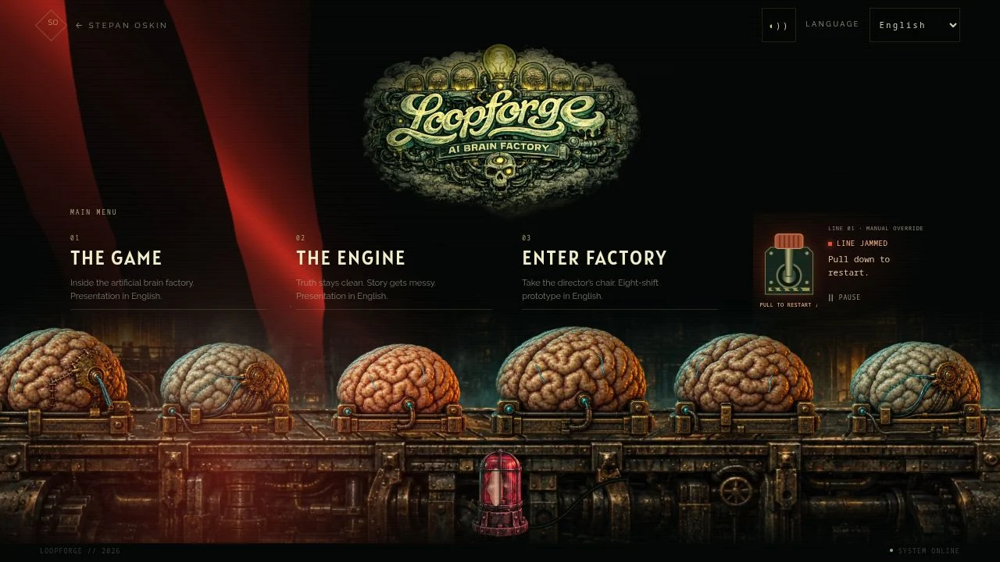
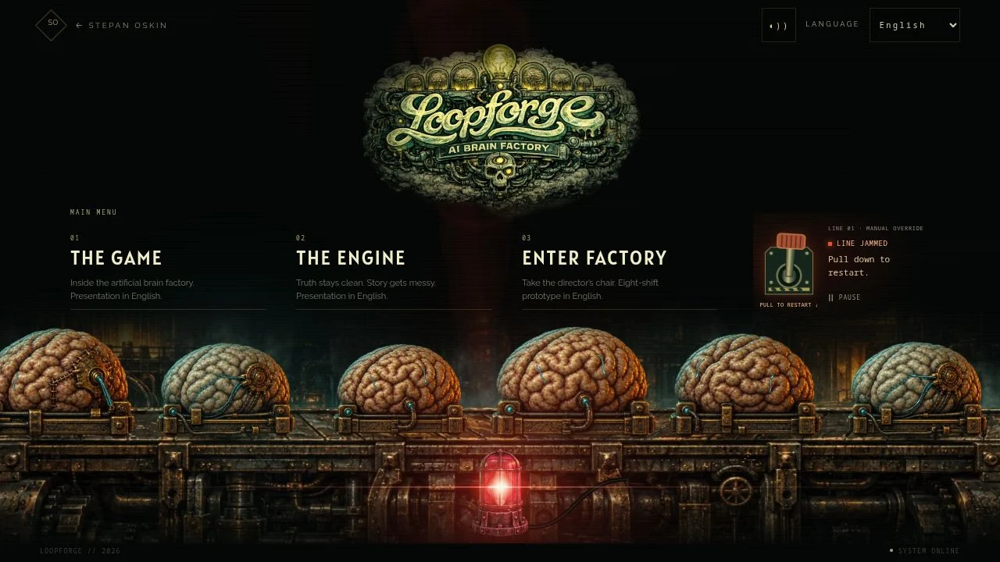

# Loopforge — side-profile specimens and alarm optics

Date: 4 October 2026. Follow-up to the accepted lattice-forge rebuild in PR #71.

## Scope and checklist

- [x] Regenerate the six brains and cradles square-on to a left-to-right conveyor.
- [x] Preserve realistic tissue, damaged/repaired variants, astronomical detail and cyan neural activity.
- [x] Register the new cell contact planes and fibre paths.
- [x] Add a smoothly accelerating alarm rotor: 0.78 rad/s idle, 3.9 rad/s alarm (8.06s / 1.61s revolutions).
- [x] Add vermilion stage lighting, sharper silhouette occlusion and warmer surface response.
- [x] Add viewer-facing bloom, a narrow horizontal streak and restrained internal lens ghosts.
- [x] Visually inspect the running / jammed / restarted scene on desktop and phone.
- [x] Complete build, interaction, motion-preference and performance checks.
- [ ] Publish a draft PR and verify its exact hosted preview.

## Optical references

- [ActionVFX Pursuit](https://www.actionvfx.com/collections/Pursuit-police-light-lens-flares-stock-footage): watched the embedded practical footage and inspected the red/blue preview frames. Directional bright cores, horizontal streaks and soft surrounding bloom informed the procedural response. No stock footage is copied or shipped.
- [ActionVFX optical collection notes](https://www.actionvfx.com/blog/new-optics-category-icon-anamorphic-lens-flares-pursuit-police-light-lens-flares-now-available): identifies the Cooke Anamorphic/i SF capture and the natural in-camera design intention.

The beacon remains upright. Its reflector makes a full revolution around the shaft.
A front-facing lobe drives optical glare; the rotating projected lobe drives the
background sweep. The alarm does not use a free-running strobe. Cached optics
replace per-frame filters and large animated CSS blur layers. Existing visibility,
manual pause, reduced-motion and disposal gates still own all drawing.

## Generated asset provenance

Built-in ImageGen edited the previous user-owned reference-based specimen atlas,
using the existing lattice plate as the camera/lighting reference. The PNG master
is retained in the local generated-images archive; the optimized build source is
`apps/lab/assets/loopforge-stage/specimens.webp`. Runtime variants remain in the
append-only `loopforge-stage` immutable media pack. Original concept-art ownership
and the previous publication approval are unchanged. This pass introduces no paid
stock purchase or new dependency.

The resulting atlas has straight horizontal bases; the lower row is registered
59 source pixels downward in the cached sprites and static fallback so every
carrier contacts the same belt plane. The registered cyan paths use the same
source offset.

### Exact image-generation prompt

Use case: precise-object-edit. Asset type: transparent game sprite atlas, 1536x1024, exactly 3 columns by 2 rows of equal 512x512 cells.
Image 1 is the brain-specimen atlas to regenerate; image 2 is the conveyor scene used ONLY as camera/perspective/lighting reference.
Primary change: rotate ALL six brain specimens and their transport cradles into exact SIDE ELEVATION for a belt moving LEFT TO RIGHT across the screen. The camera looks square-on at the LONG SIDE of each cradle, very slightly down (about 8 degrees), never at a corner. Every front edge and rear edge of every rectangular cradle is perfectly HORIZONTAL and parallel to the bottom of the image. The brains show their lateral anatomical profile, long axis left-to-right. There must be NO diagonal/isometric platform, NO visible square end-face, NO three-quarter yaw.
Keep the accepted dark realistic Loopforge tissue style: dense irregular rounded cortical folds, deep wet crevices, restrained cyan neural filaments buried in tissue, worn blackened brass and iron, fine physical imperfections. Teal ambient edge from upper left, low warm bronze edge from right. No cartoon, no toy, no schematic, no text.
Retain six distinct variants in same order: top row healthy ovoid; broad healthy brain; cool pale brain with small brass implant; bottom row damaged split tissue with tiny severed cyan fibres; repaired sutured brass implant; elongated brain with restrained astronomical brass-wire easter egg.
Sprite registration: within each 512px square, specimen centered horizontally x256, total silhouette including cradle contained x24..488 y88..452. Brain rests on a LOW horizontal straight iron transport sled; bottom of sled exactly y450. Front rail x38..474 at y410..450, shallow visible top face above it only 15px deep. Dark narrow cradle not bulky block. Organic volume remains rich.
Background MUST be real alpha transparent, with NO background haze, glow cloud, floor, cast shadow, labels, checkerboard or solid backdrop. Isolated cutout specimens only; all six fully inside cells, generous transparent gutters. Preserve smooth alpha edges.

## Verification

Production CI passed: 201 tests across 45 suites, asset integrity checks and the
optimized Next.js build. The final optical intensity/shadow-length refinement
was rebuilt; scoped ESLint is clean. The three new tests cover rotor acceleration,
continuous angle, no movement on duplicate/pause draws, and viewer-only glare.
Existing tests cover reduced motion, hidden/offscreen suspension, failed artwork
and late completion after unmount. No simulation, narration or service change.

Visually reviewed 1280×720, 390×844, 320×568, 768×1024 and 640×360 landscape.
There is no horizontal overflow. Desktop Enter and a 46px phone lever pull both
restarted a genuine jam. Manual pause held the frame count. Phone activation
areas are 62×80 for the lever and 44×44 for pause. The landing links remain usable.
A cold-load review also caught and corrected the HTML still’s belt placement;
its contact plane now follows the canvas composition rather than crossing the menu.

The final pack is 219,984 bytes for the phone and 696,144 bytes for desktop.
Including the existing 384px logo and noise gives 280,956 / 757,116 bytes at the
reviewed 390×844 and 1280×720 DPR-1 viewports. Higher-DPR logo selection can exceed
those typical budgets, as recorded in LATTICE_FORGE.md. No new runtime dependency.

Representative local CPU samples: phone 2.48ms mean / 60.6ms max over 840 frames;
final desktop optics 2.99ms mean / 76.1ms max over 2,700 frames. These include real
outliers and browser/startup contention; they are not FPS or GPU measurements.
The richer shadow mask is 80% of world resolution (formerly 55%), with cached
beam/bloom/streak/ghost textures. The primary canvas retains its pixel cap and
30fps scheduling. Field performance and cold/warm network timings are unmeasured.

Hosted verification is recorded in the PR after deployment.

