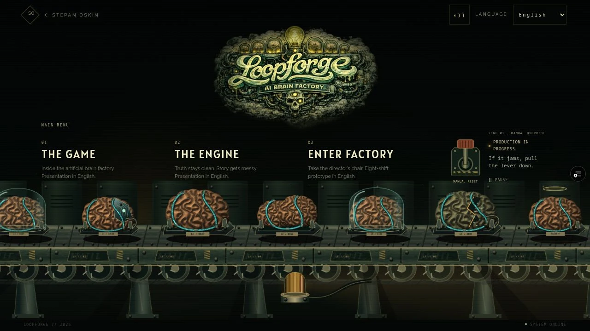
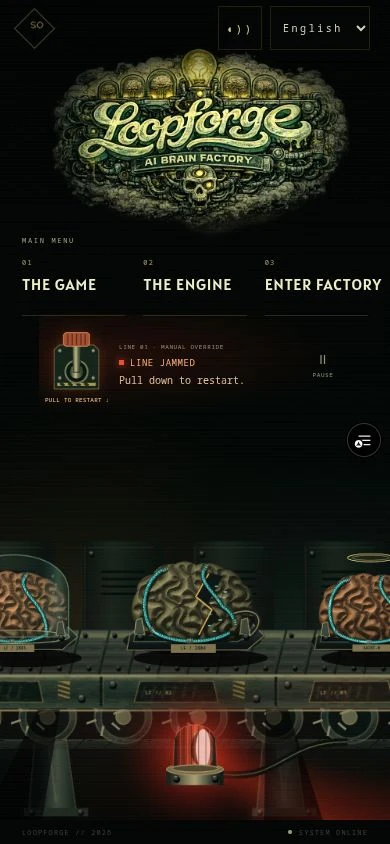

# Loopforge specimen pass · 4 October 2026

**Superseded visually by [LATTICE_FORGE.md](LATTICE_FORGE.md).** The owner
correctly identified that this pass still resembled embossed plaques and
cartoon machinery. Its functional checks did not establish reference fidelity.

Scope: the illustrated landing's brains, cyan braids, running drive and jam
instructions. The stage composition, beacon, simulation and readers stay as in
PR #66. Worktree: loopforge-presentations; branch: codex/loopforge-braincraft.

## Reference and decisions

Inspected the owned Loopforge plates in the reference repository:

- `08_loopforge_rooms_brain_forge_10.png`: domed organic specimens, close carrier
  contact, warm upper tissue and deep dark creases.
- `04_loopforge_rooms_neural_lattice_out_1.png`: large connected cortical folds,
  pronounced rounded relief and asymmetric hemispheres rather than stamped curls.
- `04_loopforge_rooms_neural_lattice_converyor_1.png` and
  `04_loopforge_rooms_neural_lattice_converyor_2_rivet_witch_cagewalker.png`:
  worn industrial sockets, varied specimens, warm/cool material contrast.

The cyan plait is a procedural interpretation of the owner's requested neural
augmentation. It has three restrained routes, constant braid pitch, explicit
strand overlap and fitted metal collars. Activity travels along the fibre;
contained discharges stay irregular and attached to one carrier.

## Checklist

- [x] Inspect original plates alongside the current entrance.
- [x] Replace repeated line-drawn curls with cached shaded cortical relief.
- [x] Refine braid routing, crossings, connectors and pulse scale.
- [x] Keep the belt advancing at uneven speed until a real jam.
- [x] Replace running copy with “If it jams, pull the lever down.”
- [x] Inspect the final desktop/phone production rendering and reset interaction.
- [x] Measure cache preparation and per-frame work; retain motion preferences.
- [x] Required tests, asset validation and production build.
- [x] Publish a scoped PR and verify its hosted preview.

## Verification

- Full required CI passes: 44 suites / 193 tests, asset integrity checks and
  optimized Next/TypeScript build. A fresh production build and focused ESLint
  pass after the cache optimization.
- Drive regression checks continuous positive movement with substantial speed
  variation, actual jam hold, gradual restart and subsequent jams. A new geometry
  check bounds sample spacing through curved braids so packets do not bunch up.
- Local production at 390×844: 45px downward lever pull changes LINE JAMMED to
  DRIVE ENGAGING. 320×568 retains the complete factory and readable running
  instructions; neither phone viewport has horizontal overflow.
- Shared-host production sample: 270ms for all specimen/signal/slat preparation,
  down from an observed 486.6ms before sharing cortical castings. At 120 drawn
  phone-sized frames, mean CPU submission was 2.25ms / max 11.8ms. These are
  bounded laboratory observations, not GPU frame time or physical-phone speed.
- Factory-containing production chunk: 40,039 raw bytes / 15,704 gzip bytes
  (previous pass 36,374 / 14,094). No new runtime image assets or dependencies.
- Final hosted desktop/phone screenshots and checks follow with the PR. Field
  Web Vitals and physical-phone performance remain unmeasured.

## Hosted result

Runtime commit `f1015aa`, Vercel READY:
https://fruitful-j8vk96s4n-stepan-oskins-projects.vercel.app/stepanoskin/loopforge

The hosted 1280×720, 390×844 and 768×1024 compositions were inspected. No
horizontal overflow or browser errors were observed. Desktop Enter and a 44px
phone pull both change LINE JAMMED to DRIVE ENGAGING; production then resumes.
Manual pause held the observed frame counter at 1440 with animation disabled;
resume restores it. Existing offscreen, hidden-document and OS reduced-motion
checks remain passing in the full suite.

Hosted shared-host sample at 240 drawn desktop frames: 222.1ms one-time specimen
preparation; 2.63ms mean / 11.8ms max CPU draw submission. These measurements are
not field Web Vitals. First-load and repeat-load UI were inspected; network
cold-cache timings and physical-phone behavior were not instrumented.

Desktop running state, including the new instructions:

Phone jam, with damaged tissue and its adjacent restart instruction:

