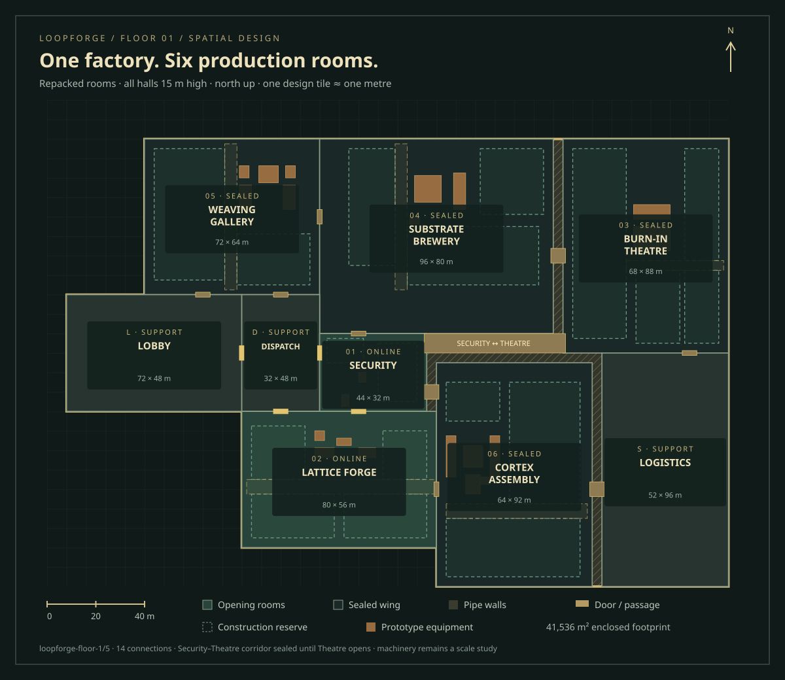

# Factory floor calibration — 10 October 2026

Scope: `/stepanoskin/loopforge/play/factory-study`, continued in PR #102. This is a procedural commissioning and scale fixture, separate from the canonical `/play` console and its economy.

## Current direction: repacked halls, one height

The owner accepted the large working scale but rejected broad utility filler as the solution to gaps. Room boundaries now reclaim that space. Every hall has the **15 m structural cornice** of the tallest original first-floor room, Cortex. Machinery and 1.9 m workers keep their existing scale. South/east walls remain presentation cutaways; their low visible sills are not different building heights. Locked-room roof plates sit on the same structural datum.

The upper-right rectangle is **Burn-in Theatre**, 68 × 88 m. The lower-right rectangle is **Logistics**, 52 × 96 m. They meet at y=104 without an empty strip. Logistics preserves the existing `shipping` identity and support role; it is not another managed room. Brewery, Security, Weaving and Cortex have adjusted bounds to pack around them. The Forge and its starter chain remain fixed.

An **8 m-wide Security–Theatre corridor** runs east between Brewery and Cortex. Its 56 m clear span, x=156…212 and y=96…104, connects the rooms directly. The existing thirteen connections survive, giving fourteen portals in total. The new corridor requires both rooms open and remains sealed on turn one. Physical adjacency permits future supervisor encounters; motives, shifts and event conditions must still authorize them.

## Measured plan

[Open the vector plan](maps/factory-floor-plan.svg). The same exported plate appears in the **Conveyor mini-game** design tab. The in-game Floor plan uses the same room and corridor authority.

| Zone | Rectangle (x, y, width, depth), metres | First-turn state |
| --- | --- | --- |
| Weaving Gallery | 40, 16, 72, 64 | Sealed |
| Substrate Brewery | 112, 16, 96, 80 | Sealed |
| Burn-in Theatre | 212, 16, 68, 88 | Sealed |
| Lobby | 8, 80, 72, 48 | Support / entry |
| Dispatch | 80, 80, 32, 48 | Support / transit |
| Security | 112, 96, 44, 32 | Unlocked |
| Lattice Forge | 80, 128, 80, 56 | Unlocked |
| Cortex Assembly | 160, 108, 64, 92 | Sealed |
| Logistics (`shipping`) | 228, 104, 52, 96 | Support; unreachable through sealed wings |

The plan extent remains **280 × 200 m**. Its stepped enclosed footprint is **41,536 m²**: **40,032 m²** of rooms, **984 m²** of pipe walls and **520 m²** of passages outside rooms. Room floor accounts for more than 96% of the footprint. The only residual solid service strips are at most four metres thick, around Brewery/Cortex. Three bundled process headers and saddles make their purpose visible in 3D. Exterior steps are the building silhouette, not interior gaps.

There are eighteen clear construction plots across six managed rooms, each reserving over 35% of its floor. The Forge retains four plots totalling **2,068 m²** and a separate six-metre delivery aisle. The larger Theatre has expanded audience/conditioning reserves. Equipment placements, operator points, encounter aprons and the opening worker route retain their physical scale and remain clear of reserves.

## Source reconciliation and ownership

`apps/lab/lib/loopforge/spatial/floor.ts` owns versioned room rectangles, the shared height, portals, admission and deterministic tile routing. Coordinates grow east/south; rectangles are half-open. One tile is approximately one metre as a design convention, not a measurement of concept art. Babylon coordinates are a presentation transform.

The old repository's `backend/sim4/world/loopforge_layout.py`, annotated factory plan and hand-drawn world plan anchor the arrangement. `REFERENCE_ZONES` retains the old 35 × 25 rectangles for provenance. Current `FOOTPRINTS` explicitly replace uniform scaling following the owner's refit request. Legacy Neural Lattice maps to Lattice Forge; Brain Forge maps to Cortex Assembly; Shipping is presented as Logistics. There are still six managed rooms and three support zones.

Sim4 omitted Security–Conveyor despite its shared boundary; owner direction and the later sim_sim interaction rule restore that edge. The new Security–Theatre corridor is another explicit owner decision. Other incompatible sim_sim edges are not introduced as invisible doorways. Reachability through a third room is not direct adjacency.

`spatial/envelope.ts` derives the filled outer shell and the exact non-overlapping complement of rooms/passages. Pipe walls provide no navigation. Admission still follows room identity and actual portals, including locked passages. Direct managed-room edges are Security–Conveyor, Security–Brewery, Security–Cortex, Security–Theatre, Weaving–Brewery, Brewery–Theatre and Conveyor–Cortex.

The spatial contract is **`loopforge-floor-1/5`**; the commissioning record shape remains **`loopforge-commissioning/4`**. The snapshot carries the new floor version. The canonical first-shift API is unchanged. Individual workers have integer positions/room identity; the renderer interpolates an authored deterministic commissioning route. This is not yet a crowd/task scheduler, free builder or later-room production system.

## Map and rendering contract

`npm run floor-plan:build` exports an original SVG from the actual layout, equipment and capacity records. `npm run floor-plan:check` rejects stale exports in the build. Docs retain a vector copy and the website uses a content-hashed file; prior releases remain available. North, metre scale, room dimensions, common height, first-turn states, fourteen connections, machinery and construction reserves are represented.

The renderer uses large floor slabs, material batching and repeated floor textures, not one mesh per tile. Work area, Whole room and Overview share the same camera and map in night construction and production. Equipment study removes later-room covers for review without changing admission. Returning to the opening restores the covers and sealed doors.

## Refit checklist

- [x] Repack rooms; expand Theatre and Logistics to fill the eastern rectangles.
- [x] Standardize structural height at 15 m; retain worker and machinery scale.
- [x] Add explicit Security–Theatre corridor and its admission/contact rules.
- [x] Limit residual structure to narrow pipe walls; draw their process headers.
- [x] Regenerate room reserves, measured map and the design-deck explanation.
- [x] Pass focused topology, corridor, containment and commissioning checks.
- [x] Complete desktop/phone visual review and the required test/build checks.
- Publication and hosted verification are recorded against the exact revision on PR #102.

Earlier scale and continuity evidence is retained in Git history and [Factory scale and equipment](FACTORY_SCALE_AND_EQUIPMENT.md). It does not certify this new geometry. Final visual calibration, free construction, unlock economics and supervisor collision stories remain subsequent work.

## Refit validation

The integrated branch passes **78 suites / 411 tests / one snapshot**. Fourteen focused spatial/commissioning tests include the new corridor's shortest direct route, sealed admission, wall crossing rejection, retained earlier connections, room/pipe/passages coverage and equipment/reserve clearance. Asset-tool test, 47 retained asset releases, generated-map freshness and focused lint pass. The optimized production build completes with exit 0, including TypeScript and static route generation.

The full suite was run sequentially after the default concurrent run was interrupted under local memory pressure; the same required test and build components passed. No test was omitted. Desktop review covers common-height Overview, the Security working view, enlarged Theatre and Logistics whole-room views, and the full-size vector plan. At 320 × 720 the map document stays 320 px wide and Escape restores focus to Floor plan. The phone header was shortened, with hall height moved to the legend. Final verification of that copy adjustment and hosted revision is recorded on the PR. Browser checks are not native-device performance certification; earlier frame-rate samples do not establish this refit's performance.
