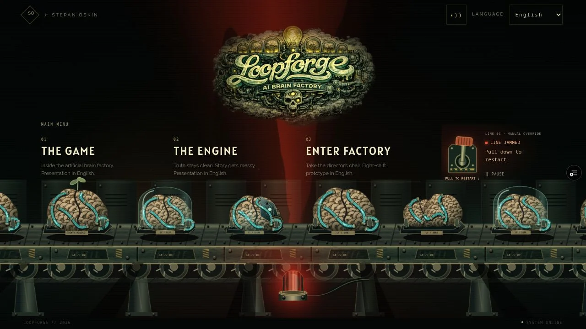
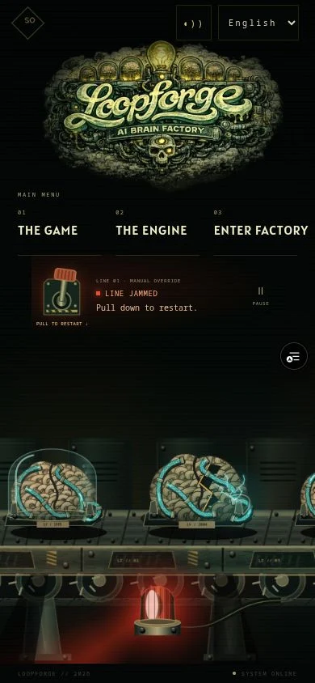

# Illustrated entrance refinement · 4 October 2026

## Direction

Start from the restored Canvas2D factory (34425c4 / PR #64). Preserve its worn
metalwork, organic tissue, palette, cargo variations and cyan braids. The rejected
Three.js rebuild is not an art direction reference. No new graphics dependency.

## Checklist

- [x] Inspect restored drawing against owner concept art and rejected stage.
- [x] Compact horizontal text navigation on black; preserve illustrated logo.
- [x] Conveyor in first viewport at 320, 390, 768px, desktop and short landscape.
- [x] Reset lever and its instruction together beside menu; keyboard and touch.
- [x] Fixed upright beacon with reflector completing full turns around its shaft.
- [x] Stage-wide soft moving light, occlusion and metal reflections; amber/red.
- [x] Held belt, periodic motor strain, local sparks and a visual invitation to reset.
- [x] Preserve varied brains, damaged cases, cyan pulses and irregular discharges.
- [x] Inspect running, jammed, restarting and paused states in actual browser.
- [x] Measure bounded render work, production delivery, console and reduced motion.
- [x] Required CI, scoped PR and verified hosted preview.

## Reference observations

Owner plates: `08_loopforge_rooms_brain_forge_10.png` and
`04_loopforge_rooms_neural_lattice_converyor_1.png`: heavy connected frames,
recessed plates, irregular tissue, worn metallic highlights and pools of light.
The WERMA revolving-beacon footage recorded in CONVEYOR_REFINEMENT.md establishes
fixed lens + moving internal reflector. Its bright sector travels through front,
side and rear; the entire housing does not rock. Light catches material locally
and shadow silhouettes interrupt the beam. Use broad soft falloff, not a red disk.
Dorner, rotating brain, welding and plasma references remain recorded there.

Checks establish behavior and measured cost. Owner visual acceptance is separate.

## Verification and delivery

- Full CI: 44 suites / 192 tests, immutable asset validation and optimized
  Next/TypeScript build pass. The final shadow opacity and compact-landscape
  adjustments receive a fresh build and browser review. Focused ESLint passes.
- New behavior checks: full continuous beacon turn; bounded jam strain with long
  rests; motion-off still state; menu-owned accessible hint; keyboard restart;
  pause/resume keeps one renderer. Existing drive, neural timing and hidden/
  offscreen/reduced-motion tests remain.
- Desktop 1280×720, phones 320×568 and 390×844, portrait tablet 768×1024 and short
  landscape 844×390 were inspected. A 43px pull changed jam to DRIVE ENGAGING.
  No horizontal overflow was observed. Small landscape 568×320 is also reviewed.
- Initial production factory-containing chunk: 36,334 bytes raw / 14,076 gzip
  (before the small final landscape rule). The observed 960px logo is 152,560
  bytes and displayed at 360px wide on the 1280×720 viewport. No new media files
  or graphics packages enter the runtime.
- Local production desktop observation at 660 drawn frames: 3.23ms cumulative
  mean / 23.10ms max CPU draw submission. A later cumulative sample (including
  viewport resizing) was 3.01ms / 23.10ms. These are shared-host browser samples,
  not GPU frame time, real-phone measurements or field Web Vitals.
- Hosted verification and final screenshots are recorded with the PR. The
  rejected Three.js screenshots are not reused as acceptance evidence.

## Hosted verification · 4 October 2026

Runtime commit: `545fc2e`. Vercel preview READY:
https://fruitful-8lg6v05iv-stepan-oskins-projects.vercel.app/stepanoskin/loopforge

Desktop keyboard Enter and a 41px phone pull both change LINE JAMMED to DRIVE
ENGAGING. Pause keeps the observed frame counter unchanged and sets animation
to false; resume restores production. Hosted desktop/390px phone report no
browser errors or horizontal overflow. The ordinary server-rendered SVG is
visible while client initialization is pending, followed by the detailed canvas;
this is observed behavior, not an instrumented network timing measurement.

The following screenshots show live jam states, not design mockups:

Final production factory chunk: 36,374 bytes raw / 14,094 bytes gzip.
