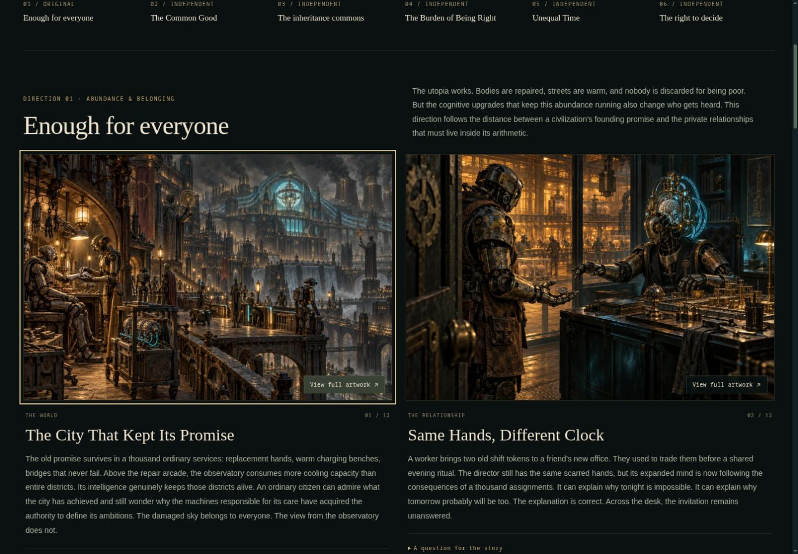
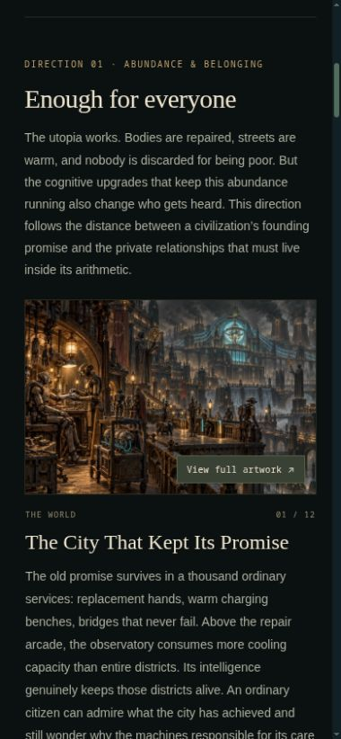

# Before the factory — story workshop

5 October 2026. Exploratory concept art for Loopforge's social prehistory; none of
these scenes establishes game canon. The user requested an original direction,
five independent art agents, and a dedicated review gallery inside The Game.

## Deliverable

Route: `/stepanoskin/loopforge/overview/before-the-factory`, linked from the
opening game chapter and every game chapter's navigation. The existing eight
chapters keep their routes and order. The gallery pairs a societal scene with an
intimate scene for each direction:

| Direction | Lens | Paintings |
| --- | --- | --- |
| Enough for everyone | Abundance and belonging | The City That Kept Its Promise; Same Hands, Different Clock |
| The Common Good | Care and entitlement | The Common Hearth; A Hand for Nothing Useful |
| The inheritance commons | Memory and inheritance | The Public Memory Works; A Gift Outside Specification |
| The Burden of Being Right | Expertise and authority | The Burden of Being Right; A Perfect Repair |
| Unequal Time | Time and intimacy | The Common Second; Waiting for Your Answer |
| The right to decide | Work and self-government | The Shift Between Shifts; The Third Key |

## Art direction and provenance

One original pair plus five separate agents, each generating two new images with
the built-in OpenAI image generation tool. All twelve outputs were visually
inspected. No third-party stock art, named artist imitation, or external image
service was used. The agents inspected owned Loopforge factory/forge and character
references. They described that visual vocabulary in their new-generation prompts;
they did not upload reference pixels to the generation tool.

Preserve dense industrial gothic machinery, oxidized brass, black iron, amber
light, restrained cyan neural braids, polluted skies, credible joints and visible
artificial brains. The new scenes lean more cinematic than the original fine
engraving plates; their palette and materials remain coherent. This difference is
appropriate to this review set, not an automatic replacement for the established
character art. Material welfare is real. Disagreements arise from agency,
recognition and practical interdependence, without a single villainous caste.

- Full generation prompts, creator attribution and original PNG hashes:
  [PREHISTORY_PROMPTS.json](PREHISTORY_PROMPTS.json).
- Curated WebP masters: `apps/lab/assets/loopforge-prehistory/`.
- Catalog: `apps/lab/assets/loopforge-prehistory.json`.
- Gallery writing: `apps/lab/lib/loopforge/prehistory-content.json`.
- Original PNGs are retained in the task's local `prehistory/masters` artifact
  folder; they are not runtime files or committed deployable media.

## Implementation and delivery

A static server-rendered gallery with six anchor destinations. Only the image
inspector needs a small client component. Native modal dialogs support keyboard
focus containment, Escape dismissal, and return to their opening button. Large
inspection images mount only when requested. Captions and story questions stay
available as ordinary page content. Artwork is displayed uncropped.

A separate immutable media pack keeps this art out of the existing chapter media
manifest. Each image has 480, 960 and 1536 pixel variants; 480px files are 36–47 KiB,
960px files 107–146 KiB, and 1536px inspection files 205–319 KiB. All 36 variants
combined are 5.02 MiB, loaded responsively and progressively rather than preloaded
as a pack. The original overview does not receive the gallery content or metadata.
No new dependencies, narration calls, simulation behavior or global style changes.

## Delivery checklist

- [x] Read project memory and inspect original Loopforge art.
- [x] Generate an original pair and commission five independent pairs.
- [x] Inspect all twelve paintings and preserve prompts/source hashes.
- [x] Build the dedicated gallery and its game-deck entry points.
- [x] Produce responsive, immutable artwork variants.
- [x] Complete production build and HTTP/media integrity review.
- [x] Complete browser interaction and responsive screenshot review (6 October).
- [x] Publish a draft PR and verify the exact preview deployment.

## Validation

- Required `API_BASE_URL=http://localhost:8000 npm run ci` passed: asset release
  safety test, 58 suites / 268 tests, production build and TypeScript validation.
- Scoped ESLint and `git diff --check` passed.
- Local production route returned HTTP 200 with all twelve paintings, twelve
  initially empty image dialogs, alt text, fixed image dimensions and six section
  anchors. All 36 responsive artwork files returned HTTP 200 with WebP MIME types.
- The opening game chapter has two working gallery hrefs, and its rendered payload
  contains no gallery story content. Gallery HTML is 98,471 bytes uncompressed.
- All twelve source paintings were visually inspected before integration.
- Browser review completed on 6 October after reconnecting the in-app browser:
  320×760, 390×844, 768×1024 and 1440×1000 CSS pixels, DPR 1. No horizontal
  page overflow or broken images. Gallery controls meet the 44px height target.
- Verified game chapter → workshop → direction anchors → artwork inspector →
  return to game chapter. Inspected desktop/tablet pairs and stacked phone figures.
  Dialog opening mounts one inspection image; Escape and the Close button dismiss
  it, remove the inspection image and return focus to the initiating artwork.
  Story questions expand, and the existing motion control pauses/resumes correctly.
- Responsive selection: desktop 1440×1000/DPR 1 initially selected four 960px files,
  totaling 541,386 bytes (529 KiB). Phone 390×844/DPR 1 selected four 480px files,
  totaling 169,774 bytes (166 KiB). Later artwork stays lazy. Those are observed
  image selections, not network-throttled field measurements. Higher DPR devices
  may request larger files and remain unmeasured.
- Production HTML is 22,622 bytes gzip on two successive requests. Fresh and repeat
  page loads rendered consistently; browser timing APIs were unavailable through
  the inspection tool, so no numerical LCP/INP/CLS or cold/warm latency claim is made.
- Gallery motion is limited to the inherited conveyor; manual pause was exercised.
  The new hover transition has a reduced-motion rule. OS preference emulation and
  physical phones were not available; field Core Web Vitals remain unmeasured.
- No browser warning/error messages were recorded during this review.

### Review screenshots

## Publication

[Draft PR #91](https://github.com/stepan-o/fruitful-lab/pull/91) contains the gallery.
[Verified preview](https://fruitful-4na84dki3-stepan-oskins-projects.vercel.app/stepanoskin/loopforge/overview/before-the-factory)
is READY for runtime commit `0e38dfc14461afa4a80e819e875e5f060a17d16e`.
The hosted browser check confirmed twelve paintings, responsive image loading,
no desktop overflow, inspector opening and Escape dismissal. Desktop and phone
layout checks above used the same runtime source. This record is a docs-only
follow-up; current deployment status is also recorded in the PR.
