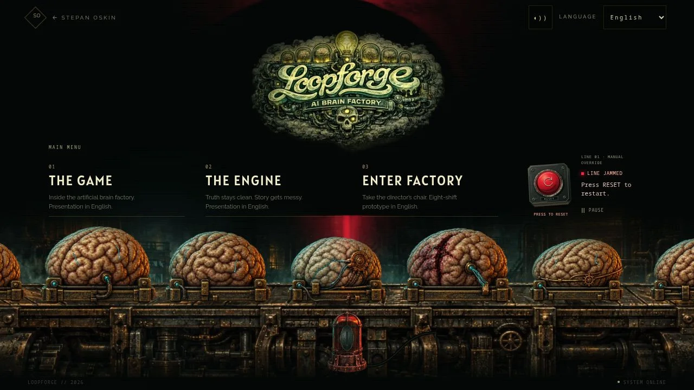
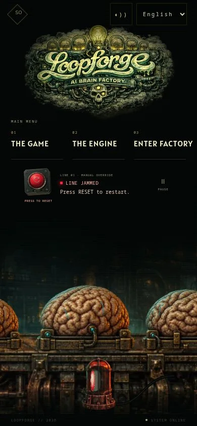

# Loopforge — red reset button

5 October 2026. Scope: the landing's decorative factory line and menu control.

## Checklist

- [x] Inspect Loopforge access-control and lattice-conveyor artwork.
- [x] First jam after three seconds of visible active motion; later intervals vary.
- [x] Replace the lever with a shallow oblique red push button.
- [x] Update instructions and preserve keyboard, touch and pause support.
- [x] Verify timing, repeat reset, loading and visibility boundaries.
- [x] Review the actual landing at desktop, 320, 390, 768 px and landscape.
- [x] Run full CI and record production measurements/screenshots.
- [ ] Publish a scoped draft PR and verify its exact hosted preview.

## Art direction

Source references in the Loopforge repository's concept-art directory:

- `rooms/03_loopforge_rooms_access_control_8.png`: recessed red controls,
  concentric collars, bolted override console and engraved nameplates.
- `rooms/03_loopforge_rooms_access_control_5.png`: oxidized dark metal,
  fine worn edges and restrained cool highlights.
- `rooms/04_loopforge_rooms_neural_lattice_converyor_1.png`: industrial wear
  and machinery rather than a clean plastic toy.
- `characters/conveyor_operations/stiletto_conveyor_failure_overdrive.png`:
  warm highlights against deep red and black.

The control is original SVG geometry, mostly frontal with a shallow oblique
housing and a short inward cap travel. Patina is static. The alarm collar
animates only opacity; the pressed cap animates only transform. No new image
requests, runtime library, per-frame React update or large blur surface.
The scene's lighting, specimens, alarm motor and shadow projection are unchanged.

## Timing and interaction

The first jam occurs at three **active** seconds after artwork is ready and the
scene is visible. Loading, manual pause, hidden tabs, offscreen and reduced motion
cannot consume this countdown. As before, long browser stalls do not fast-forward
machine motion. Reloading or returning to a newly mounted landing starts it again.

After each reset, the next interval is 33–55 active seconds. A seed sampled once
on mount varies the intervals between visits; deterministic hashing makes each
sequence testable. The decorative machine remains separate from the game kernel.

A native button accepts click, tap, Enter and Space. Reset is guarded while running
or restarting. The nearby hint names the RESET control, and status changes
are announced politely. Pressing does not capture touch or prevent page scrolling.
Reduced motion retains an immediate pressed state without an animated release.

## Validation

Full CI passes: 223 tests in 48 suites, asset-integrity checks and the optimized
production build. Scoped ESLint and the React review also pass. Tests cover the
three-second boundary, random interval bounds and repeatability, uninterrupted
uneven movement after reset, duplicate activation, Enter/Space/touch, delayed
artwork, hidden/offscreen suspension, persistent pause and reduced motion.

The actual route was inspected at 1280×720, 768×1024, 390×844, 320×568 and
640×360. No horizontal overflow or obscured control. Reset hit areas are 92×112
on desktop, 62×80 on phones and 50×80 in narrow landscape; the pause target is
at least 44×44. Tablet proportions and copy were tightened after visual review.
Native Enter, Space and a phone-size click restart real jams. Touch input is also
covered by the component test; this is browser viewport emulation, not a physical
phone test. OS-level reduced motion was covered automatically, not toggled manually.

The production desktop sample (DPR 1, 360 draws including alarm) recorded
9.43 ms mean, 26.00 ms rolling p95 and 62.90 ms maximum CPU submission time;
post-load artwork bake 477.00 ms. These are host-dependent CPU timings, not GPU
or physical-device frame-rate measurements. The first-load illustrated fallback
remains visible through the bake. Field Core Web Vitals remain unmeasured.

No additional runtime image bytes: the existing scene pack remains 219,984 bytes
on phone and 696,144 bytes on desktop. New SVG details are bundled with the control.

Phone production sample (390×844, DPR 1, 1,200 draws): 4.02 ms mean,
8.10 ms rolling p95, 22.00 ms maximum and 153.50 ms post-load bake. No browser
errors. Game-deck navigation and warm return to the landing also work. Network
cold/warm timings are not measured. Exact hosted verification is recorded in
the PR to avoid rebuilding the app for a documentation-only status update.

