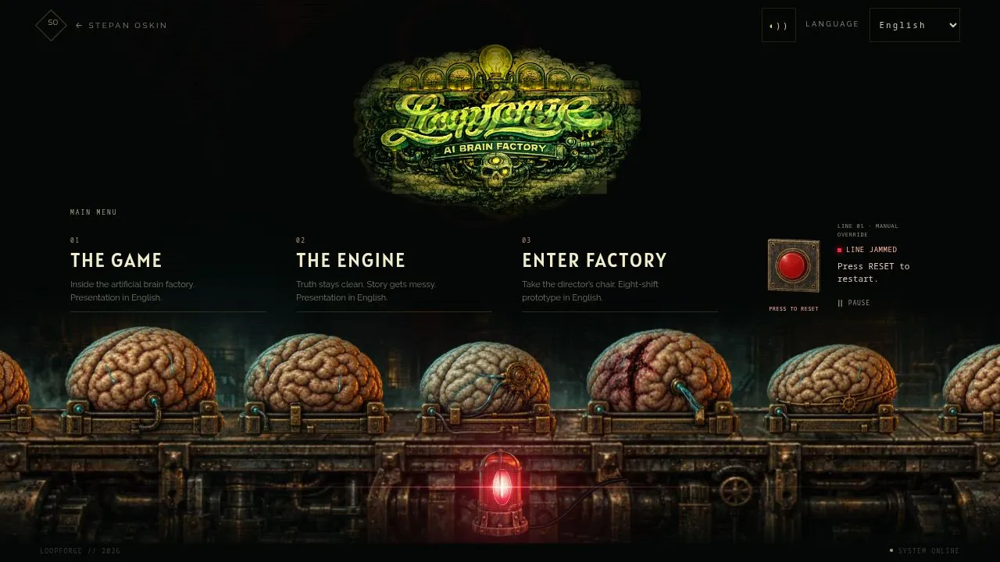
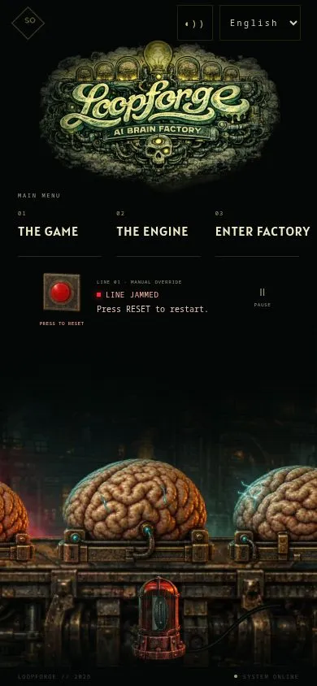

# Loopforge — painted reset button

5 October 2026. Scope: the landing’s decorative factory line and menu control.

## Delivery checklist

- [x] Inspect Loopforge access-control, lattice-conveyor and logo artwork.
- [x] First jam after three active seconds; later intervals vary.
- [x] Replace the lever with a native red push button and nearby instructions.
- [x] Produce painted idle, hover and pressed assets with no circular arrow.
- [x] Correct housing and cap using one shared camera and extrusion axis.
- [x] Package responsive immutable media; retain a usable failed-image fallback.
- [x] Verify keyboard activation, phone-size activation and fixed control geometry.
- [x] Inspect desktop, 320 px, 390 px, tablet and landscape production layouts.
- [x] Pass full CI, scoped lint, asset integrity and production build.

Publication and exact hosted-preview verification are recorded in PR #82 after
the artifact commit, avoiding an extra deployment for a status-only edit.

## Art direction and assets

Source references in the Loopforge concept-art collection:

- `rooms/03_loopforge_rooms_access_control_8.png`: recessed controls, bolted consoles and concentric collars.
- `rooms/03_loopforge_rooms_access_control_5.png`: oxidized metal, worn edges and cool highlights.
- `rooms/04_loopforge_rooms_neural_lattice_converyor_1.png`: industrial surface texture and machinery.
- `characters/conveyor_operations/stiletto_conveyor_failure_overdrive.png`: warm highlights against red and black.

Original painted raster artwork, generated with the built-in image_gen tool,
matches the conveyor and logo. Three registered states share a worn gunmetal and
brass plate: a plain raised crimson cap, an illuminated hover state and a pressed
cap seated inside its socket. There is no circular arrow, icon or lettering on
the cap. A common 3D projection guide gives the housing and cap parallel faces
and matching top/right thickness. Straight plate edges avoid the previous
inward-curving geometry; pressing follows the same mechanical axis.

The source is `apps/lab/assets/loopforge-controls/reset.webp`, a lossless
1152×384 atlas with three 384×384 frames (idle, hover, pressed). Prompts are
recorded in [RESET_ASSET_PROMPTS.md](RESET_ASSET_PROMPTS.md). Original generated
PNGs remain outside the deployment. Rejected intermediate assets are not shipped.

The existing media pipeline produces 384×128 (14,464 bytes) and 768×256
(48,918 bytes) WebP variants with lossless alpha. All states use the same selected
URL, so first hover/click needs no additional request. At DPR 1 the tested desktop
and phone both selected the smaller variant. Higher-density displays can select
the larger one. The factory scene pack is unchanged (219,984 bytes phone /
696,144 bytes desktop). No runtime library, model call, per-frame React update,
animated filter or additional scene rendering loop is introduced.

Hover and keyboard focus crossfade to the illuminated asset over 100 ms. Press
is immediate, followed by a 220 ms release. A restrained blend of the lit asset
invites interaction during a jam and follows existing motion gates. Fine-pointer
hover avoids a sticky touch state. A labelled HTML fallback preserves the reset
action if media fails. Reduced motion removes transitions and pulses while
retaining direct pressed feedback.

## Timing and interaction

The first jam occurs at three active seconds after artwork is ready and the
scene is visible. Loading, manual pause, hidden tabs, offscreen and reduced motion
cannot consume the countdown. Long browser stalls do not fast-forward the drive.
A fresh mount restarts the opening countdown.

After each reset, the next interval is 33–55 active seconds. A seed sampled once
on mount varies each visit, with deterministic hashing for repeatable tests.
This decorative machine remains separate from the game kernel.

The native button accepts click, tap, Enter and Space. Reset is guarded while
running or restarting. The nearby hint reads “Press RESET to restart.” and
status changes are announced politely. “Restarting. Stand clear.” fits the same
space without shifting the button. Touch is not captured and page scrolling
remains available.

## Validation

Full CI passes: 224 tests across 49 suites, asset-integrity checks (9 retained
releases) and the optimized production build. Scoped ESLint also passes. Tests
cover jam timing, random intervals, duplicate reset, keyboard/touch activation,
delayed artwork, hidden/offscreen suspension, pause, reduced motion and media
failure after a responsive image reload.

The final painted control was visually inspected on the production build at
1280×720, 768×1024, 390×844, 320×568 and 640×360. No horizontal overflow or
obscured controls. Reset targets are 92×112 desktop, 76×112 tablet, 62×80 phone
and 50×80 narrow landscape; pause remains at least 44×44. Real hover selected
the lit frame at opacity 1. Space activation displayed the pressed frame at
opacity 1 and restarted the line. A phone-size click also restarted a real jam.
Before/after button bounds were identical on desktop and 320 px phone.
All three frames were fully loaded from the same atlas before interaction.
No browser console errors were observed.

These are browser viewport checks, not physical-device tests. Reduced motion is
covered automatically; OS settings were not changed. Earlier vector-delivery
CPU timings do not constitute a new raster-pass benchmark. Field Core Web Vitals
and cold/warm network timing remain unmeasured. The renderer itself is unchanged.

