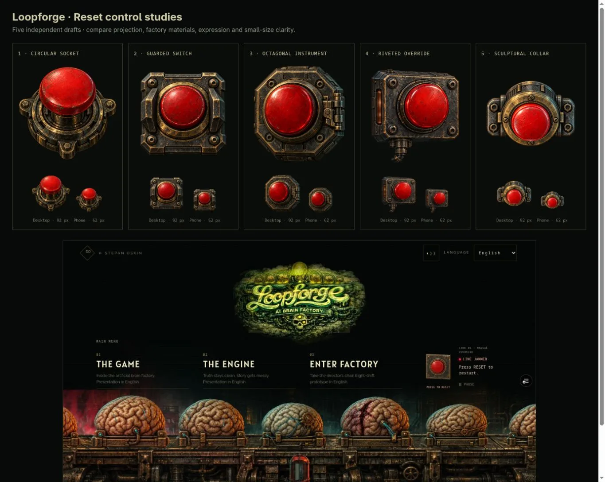

# Loopforge reset — five-draft selection

5 October 2026. The user requested five subagent-generated alternatives after
rejecting the rectangular button’s perspective. Three subagents produced five
distinct concepts from the actual Loopforge conveyor, logo and control-room art.
The previous button and projection guide were excluded as generation references.
Built-in image generation was used throughout.

## Comparison and decision

All five were inspected enlarged and at actual 92 px desktop / 62 px phone sizes,
alongside the landing. Three agents independently re-reviewed all five rather
than only defending their own designs. Physical coherence was the acceptance
gate; expression, factory materials and small-size clarity decided the fit.

| Draft | Strength | Decision |
| --- | --- | --- |
| 1 · Circular mushroom | Most overtly tactile; cap, stem and socket agree | Rejected: steep overhead angle and tall stem read as a tabletop push-down control. |
| 2 · Guarded station | Strong red center and protective shoulders | Rejected: opposing guard facets and top/bottom casing bevels repeat the ambiguous depth. |
| 3 · Octagonal instrument | Expressive silhouette and broad red face | Rejected: nested bevels compete; large hinge makes it resemble a hatch. |
| 4 · Riveted override | Strong industrial construction and lateral projection | Runner-up: lower casing edges retain a possible competing underside cue; connector consumes thumbnail space. |
| **5 · Cylindrical socket** | **One clear depth axis, compact mounting ears and distinct crimson/brass silhouette** | **Selected. Closest to the near-frontal scene while resolving the primary geometry concern.** |

Two independent reviewers preferred 5 overall; the third preferred 4 for factory
character but confirmed 5 remained clear at 62 px after seeing the comparison.
The main agent selected 5 because the repeated perspective complaint outweighs
4’s extra casing detail. Its larger exposed upper barrel was explicitly reviewed
rather than assumed invisible; the small-size result remained legible and compact.

## Production asset

Only draft 5 and its registered hover/pressed derivatives enter the deployed
media pack. Unselected full-size drafts and their exact prompts remain in the
local visual review artifact. [Selected prompts](RESET_ASSET_PROMPTS.md) preserve
the idle generation, targeted camera correction and final state edits.
The interaction code, jam timing, page layout and factory renderer are unchanged.

The circular design’s rear barrel recedes upward behind the collar; its cap
advances slightly downward toward the viewer. Pressing travels back into that
socket. No square plate or conflicting corner extrusion remains.
