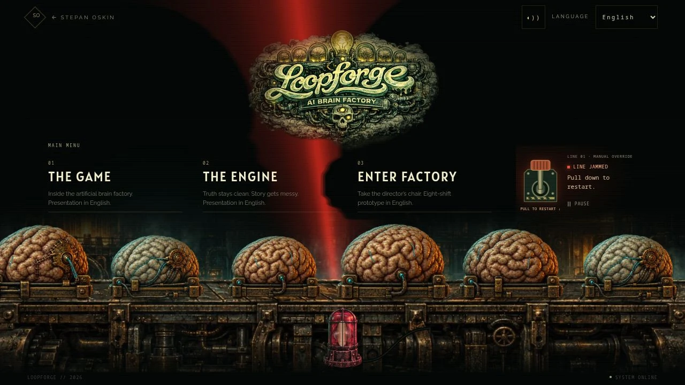
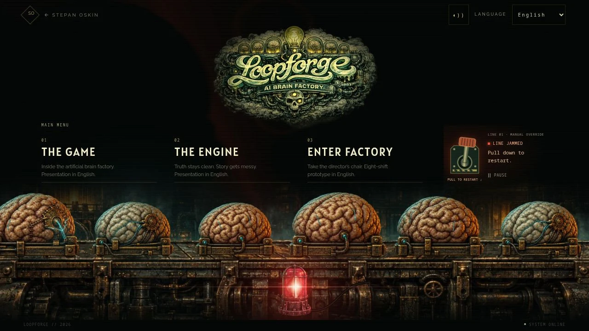
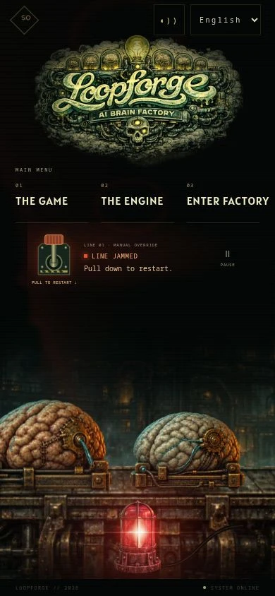

# Loopforge — spatial light pass

4 October 2026. Focus: make the accepted illustrated factory's beacon, shadow
projection, surface illumination and viewer glare agree spatially.

## Acceptance checklist

- [x] Inspect the accepted stage and identify the stretched/sheared shadow mismatch.
- [x] Use one emitter position for the visible reflector, beam, shadows and lens glare.
- [x] Bake detailed opaque brain/cradle contours from the current six specimen assets.
- [x] Project onto a defined rear receiver with source → blocker → shadow collinearity.
- [x] Retain sharp cores with a narrow finite-source penumbra.
- [x] Preserve the independent cyan/amber ambient base in shadowed areas.
- [x] Apply the beam footprint to brain and machinery textures.
- [x] Cache contour paths; bound drawing resolution; keep the existing 30 fps scheduler.
- [x] Add geometric regression tests, including notch preservation and moving emitters.
- [x] Production build and complete test suite.
- [x] Desktop, 320/390/768 px and landscape visual inspection.
- [x] Keyboard restart, phone lever drag, pause and resume checks.
- [x] Record local drawing cost.
- [ ] Verify the exact hosted preview (results to be recorded in the PR).

## Geometry and compositing

The original shadow was a vertically stretched sprite with an independent shear.
It could look dramatic while missing the line from the visible bulb through its
caster. The new rear-plane point is `Q = S + 3.4 × (P − S)`: S is the emitter and
P is an opaque contour point after the exact same translation, scale and chatter
used by the specimen. The depth ratio is an art-directed stage parameter.

The caster and receiver are parallel planes in a lightweight 2.5D model. This
preserves perspective-ray alignment without claiming that the background painting
contains a reconstructed 3D mesh. The six contours include the cradle and brain
outline, preserve concave exterior details and reject faint transparent bloom.
Internal holes smaller than the outer row contour are not modelled. Cyan emission
and baked environmental lighting remain visible under the beacon's shadows.

Three deterministic filament samples produce a narrow penumbra. All casters are
unioned per sample before averaging, preventing overlapping specimens from
multiplying darkness. The mask removes only this lamp's direct contribution.
Cached material tints receive the spatial beam footprint rather than a single
brightness value for the whole sprite. Foreground iron is treated as a receiver
in front of the cargo. The lens streak's peak follows the same emitter.

## Performance contract

No new framework, downloads or texture assets. Six contour paths are baked once;
frames use affine path transforms and cached textures. No per-frame image readback
or animated blur. A disposable CPU atlas canvas extracts alpha at startup; the
GPU sprite caches are never read back. Lighting buffers are capped at 1400 × 900 pixels and 80% of the
stage's logical resolution; the existing main-canvas cap and 30 fps scheduler stay.
A reusable 256 px material scratch canvas handles individual receivers. Paused,
hidden, offscreen and reduced-motion scheduling retains its existing behavior.

The canvas exposes a rolling 120-draw p95 in addition to cumulative mean/max.
These are CPU submission timings in the test browser, not end-to-end GPU frame
latency or field Core Web Vitals. Field performance remains unmeasured.

## Research basis

- [NVIDIA GPU Gems: Efficient Shadow Volume Rendering](https://developer.nvidia.com/gpugems/gpugems/part-ii-lighting-and-shadows/chapter-9-efficient-shadow-volume-rendering): separate ambient/emissive illumination from the light's visibility contribution; match the visible alpha silhouette rather than the billboard rectangle.
- [NVIDIA: Percentage-Closer Soft Shadows](https://developer.download.nvidia.com/shaderlibrary/docs/shadow_PCSS.pdf): the parallel-plane relationship between source size, blocker distance and receiver penumbra. This implementation samples a small emitter; it does not implement PCSS.
- The existing [alarm optics references](ALARM_OPTICS.md) remain applicable to the rotating reflector and forward-facing lens response. No stock imagery or external runtime dependency was added.

## Validation

The full CI pass completed: 211 tests across 47 suites, asset integrity checks
and the optimized Next.js build. After conservative culling of offscreen casters
and off-beam receivers, the 17 focused geometry/rotor/lifecycle checks passed.
The dedicated CPU extraction refinement also passed the six geometry checks,
scoped ESLint and final production build.

The production route was visually checked at 1280×720, 390×844, 320×568,
768×1024 and 640×360 landscape. No horizontal overflow or hidden controls.
Desktop Enter restarted a real jam; manual pause held the frame counter and
resume restarted drawing. A 46px phone lever drag changed LINE JAMMED to DRIVE
ENGAGING. The phone lever remains 62×80 px and pause remains 44×44 px. Existing
automated tests cover OS reduced motion, hidden/offscreen suspension and disposal;
OS-level reduced motion was not toggled manually in this browser.

Final local samples at DPR 1:

| Viewport | Draws | Cumulative mean | Rolling p95 | Observed maximum | Initial bake |
| --- | ---: | ---: | ---: | ---: | ---: |
| 1280×720 | 960 | 2.25 ms | 5.20 ms | 18.70 ms | 279.00 ms |
| 390×844 | 720 | 1.54 ms | 4.20 ms | 10.40 ms | 117.60 ms |

These samples include the initial run and a real alarm. They are desktop-browser
viewport emulations, not measurements from physical phones. Initial silhouette
extraction/baking is one-time work while the illustrated HTML fallback remains
visible; the bake timings are retained here as a startup limitation. Warm reloads
and navigation rendered successfully; network cold/warm timings and field CWV
remain unmeasured. No browser errors were observed.

The media pack is unchanged: 219,984 bytes phone / 696,144 bytes desktop; including
the existing DPR-1 logo and noise selection, 280,956 / 757,116 bytes. No new runtime
image, dependency, LLM call or model cost is introduced.

Hosted verification will be recorded in the PR once its exact deployment is ready.
The two pre-existing global-memory edits remain local and outside this PR.

