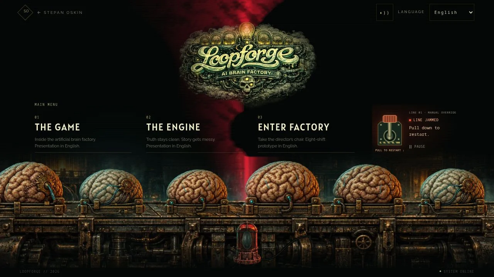
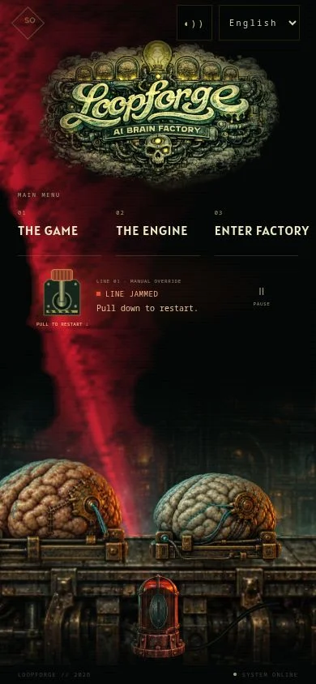

# Loopforge — STILETTO optics

5 October 2026. Focus: readable front/back reflector orientation, a saturated
STILETTO alarm palette, and textured grazing light across the factory wall.

## Checklist

- [x] Inspect STILETTO character sheet 2, security and conveyor overdrive artwork.
- [x] Keep the accepted side-on specimens and 3.9 rad/s alarm motor.
- [x] Replace the mirrored luminous face with an opaque metal bowl and separate aperture.
- [x] Derive scarlet/crimson edge and warm white core from STILETTO's visor contrast.
- [x] Add irregular refractive lanes and bounded continuous variation to the beam.
- [x] Bake stationary relief; modulate direct light before applying the shadow mask.
- [x] Verify front/rear/side phases, jam/reset and motion pause in the real route.
- [x] Inspect desktop, 320/390/768 px and landscape.
- [x] Full CI: 219 tests / 48 suites, asset integrity and production build.
- [x] Record final production drawing cost.
- [ ] Publish scoped draft PR and verify its exact hosted deployment.

Original references are in the Loopforge source repository under
`frontend/loopforge-webview/public/assets/concept_art/characters/`:
`character_sheets/set_2/stiletto_character_sheet_2.png`,
`security_operations/stiletto_security.png`, and
`conveyor_operations/stiletto_conveyor_failure_overdrive.png`.
These guided the palette; no new copies are shipped.

The wall relief is an art-directed hammered-sheet height field, not a depth
reconstruction of the painted architecture. It is fixed in world space and lit
from the shaft position. The 13 px emitter orbit is approximated at the shaft
for these shallow microfacets only; all silhouette projections, beam origin,
material masks and viewer glare still use the actual moving emitter.

Two cached beam variants blend slowly, with narrow continuous power/width
variation. No per-frame pixel reads, blur filters or noise baking. Added textures
are generated locally; no image download or new dependency. Existing scheduling,
manual pause, reduced motion and hidden/offscreen disposal remain unchanged.

Scope: Loopforge rendering and its tests/docs only in apps/lab; other projects,
simulation and provider configuration excluded. The two earlier global-memory
edits are preserved in a named stash and /tmp patch, outside publication.

## Opening chapter copy

The user also requested the deck label “The factory” and subcaption
“A workplace dystopia with a production drama and quota”. Those are applied.
The existing headline remains while the opening's editorial direction is discussed.
Recommendation: introduce the player fantasy, production setting and workplace
conflict first, with “Run a factory that builds minds.” as a concrete heading.
The director chapter can explain controls; the engine deck can explain system
architecture. This recommendation is not yet applied to the presentation.

## Validation record

Full CI passes: 219 tests across 48 suites, immutable media integrity checks
and the production build. The 19 focused geometry, motor and lifecycle checks
also pass. Browser evidence and final timing samples follow below.

Production route visually checked at 1280×720, 320×568, 390×844, 768×1024
and 640×360. A full alarm revolution shows a luminous aperture, a compressed
side profile, then an opaque ribbed back; only the front produces viewer glare.
The alarm reaches 3.90 rad/s. Source/caster/receiver geometry remains unchanged.
Keyboard Enter and a 46 px phone lever drag both restart actual jams. Pause
stops drawing; resume works. The phone lever is 62×80 px and pause is 44×44 px.
No horizontal overflow or browser errors. Revised chapter labels render on mobile.
Automated lifecycle tests cover reduced motion and hidden/offscreen suspension;
OS-level reduced motion was not manually toggled.

Local production CPU submission samples at DPR 1 (not GPU or physical-phone FPS):
- Desktop fresh entry, 1,080 draws including alarm: 4.75 ms mean / 12.90 ms
  rolling p95 / 34.40 ms observed max; post-load artwork bake 447.10 ms.
- Phone initial run, 360 draws: 2.14 ms mean / 2.40 ms rolling p95;
  post-load artwork bake 240.60 ms. After responsive and alarm checks, the
  last 120 draws back at 390 px had a 9.70 ms p95. That session's cumulative
  mean includes other viewport sizes and is not reported as a phone average.

The extra cached surfaces cost more drawing work than the plain beam. These
CPU samples fit the existing 33.3 ms schedule for most frames, but do not prove
GPU throughput, physical-phone performance or field Core Web Vitals. The earlier
dev session had severe host contention and is not used as production evidence.
The static illustrated fallback remains present during the one-time bake.
Warm return navigation was verified; network cold/warm timings and field CWV
remain unmeasured. No additional runtime media bytes: the unchanged pack is
219,984 bytes phone / 696,144 bytes desktop.

Exact hosted deployment verification will be recorded in the PR.
