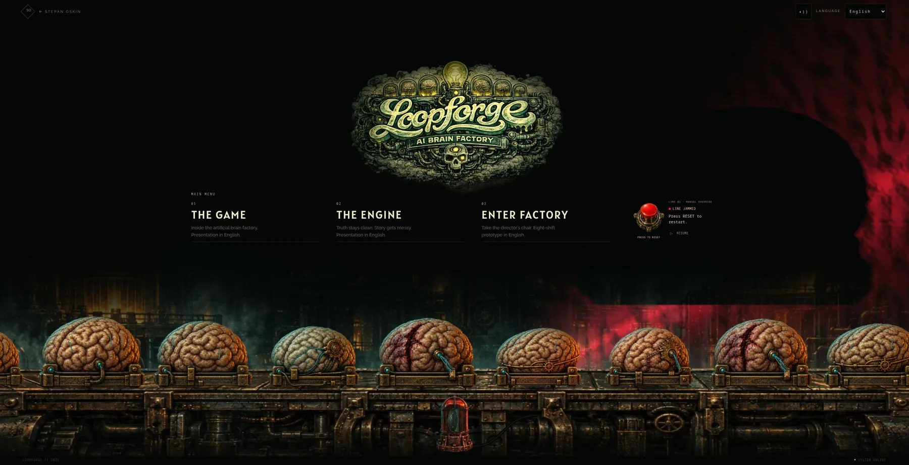
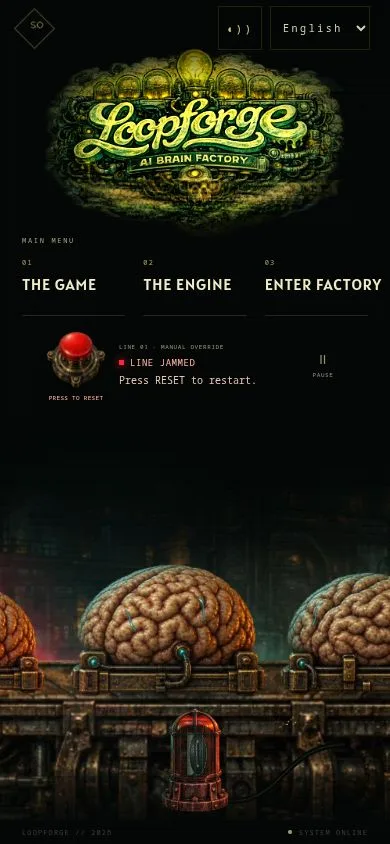

# Loopforge large-screen rendering

5 October 2026. Scope: the landing scene and its entrance composition.

## Defect

At 2555×1310 the renderer capped world width at 1800 but retained an unscaled
world height. Its final canvas transform therefore enlarged X by approximately
1.42 while leaving Y unchanged. Brains, beacon and projected shadows flattened.
The entrance also retained its small desktop dimensions with a large empty gap.

## Correction

`factory-viewport.ts` fits both world dimensions with one scale. Large screens
increase scene size proportionally; shallow ultrawide windows limit growth by
height and reveal additional cargo instead of stretching or cropping specimens.
The existing smaller-screen scale rules remain intact.

Raster resolution stays separate: the final canvas remains capped at 2100×1400,
lighting at 1400×900, wall relief at 960×720, and the cached factory plates at
1800×1400. No new artwork, downloads, libraries or animation loop. The existing
30 Hz schedule, reduced-motion, offscreen, hidden-tab and manual-pause gates remain.

At 1600×900 and larger, the entrance reserves room for the scaled production
line, centers in the remaining space, and uses a wider menu and responsive logo.
The logo's `sizes` and the static specimen fallback follow their displayed size.
The selected draft 1 reset button and its states remain unchanged.

## Delivery checklist

- [x] Reproduce the supplied 2555×1310 composition.
- [x] Preserve equal horizontal and vertical world scale.
- [x] Bound raster allocation independently from world dimensions.
- [x] Add proportion/budget regression coverage, including shallow ultrawide.
- [x] Complete CI checks and production viewport checks.
Publication and exact hosted-deployment verification are recorded in the PR after
the artifact commit.

## Verification

255 tests across 55 suites pass, including 11 new viewport cases/invariants.
Asset integrity and scoped ESLint pass. The optimized production build passes;
the first build process was interrupted during generation, and a persistent-terminal
retry completed successfully without code changes.

Production browser checks: 2555×1310 (reported size), 1920×1080, 3840×1080,
3840×2160, 768×1024, 390×844, 320×568 and 640×360. Specimens and beacon retain
proportions, the conveyor stays visible, and no horizontal page overflow or
obscured controls was observed. Enter at the reported size and phone-size click
restart an actual jam. Manual pause stops animation and resumes correctly.
No browser console errors. Reduced motion remains covered by automated tests;
OS preferences were not changed.

At 2555×1310/DPR 1 the canvas was 2100×1057, the logo displayed at 602.6 px and
loaded the existing `15f205aa…` responsive file. One local production sample
reported 9.55 ms mean draw time and 15.60 ms rolling p95 after 360 frames. This
is a shared-host lab observation, not a physical-device benchmark or FPS guarantee.
At 3840×2160 the canvas remained 2100×1168. First navigation and reload both
resolved the art; controlled cold/warm network timings remain unmeasured.

Field Core Web Vitals and physical-device performance remain unmeasured.
