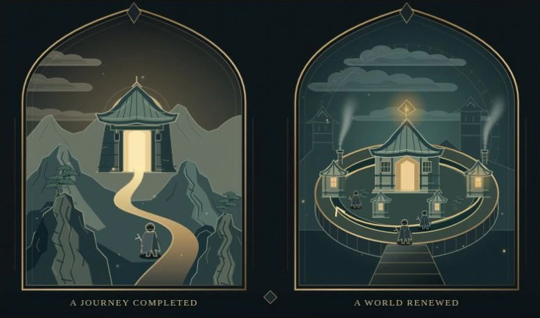

# Sanctuary design system

**Editorial placement update · 3 October 2026:** the first chapter now uses an
original arcade-cabinet cutaway and Atari’s operator manual. The authentic BG3/D4
pair, AfterPurchase and cinema/catalog exhibits now belong to chapter three.
The approved animated diptych stays in **Where progress lives**. Its historical
description as the “opening” below identifies the illustration benchmark.
See [Narrative reconstruction](NARRATIVE_REBUILD.md).

**Version 1.3 · 2 October 2026 · approved visual reference with experience-first opening**

An illustrated essay about the relationship between game design, the player,
and the business. The experience should feel like opening a beautifully made
book inside a strange, working machine. Reading stays calm. Worlds feel inhabited.
Instruments make an argument tangible.

This is the design reference for Sanctuary Economics within Stepanoskin, not a
replacement for the other Fruitful Lab brands. It records the current local
implementation and the owner's accepted direction. It does not imply that these
local changes have been published or that every chapter has received the latest
illustration pass. Code remains the authority for shipped behavior.

- [Visual reference sheet](design-system/index.html) — open locally in a browser;
  palettes, type, control states and the approved scene. No server required.
- [Visual research and chapter inventory](VISUAL_DIRECTION.md) — Loopforge
  references, scene/exhibit pairs and earlier validation history.
- [Content, provenance and research mode](README.md).
- [Asset publishing and cache contract](../../apps/lab/assets/README.md).

## 1. The design thesis

| Layer | Its job | Its character |
| --- | --- | --- |
| Reading surface | Let an argument develop without interference | Near-black, generous serif prose, fine rules, small quiet navigation |
| Original plate | Give the chapter a memorable visual idea | Engraved worlds, warm focal light, deep teal shadow, coherent material detail |
| Working instrument | Let the reader inspect a relationship | Tactile controls, explicit conditions, immediate consequences, readable comparisons |

The owner's Loopforge and Chaos Goblin sensibility supplies personality:
handmade machinery, controlled strangeness, discovery and mechanical mischief.
Sanctuary supplies the setting: brass, soot, ember, ceremonial architecture and
an infernal mural. Every unusual detail should reward attention or clarify the
subject. Dense decoration must never become the price of reading.

**Preserve:** strong silhouettes, deliberate asymmetry, crafted frames, material
contrast, a clear focal light, and room for the eye to rest. Each chapter gets
its own composition and instrument while sharing these materials and behaviors.

**Reject:** a repeated card grid for every idea; unexplained gauges or decorative
sliders; gradients substituting for geometry; constant competing effects;
captions that merely describe the picture; claims hidden behind clever wording.

## 2. Approved reference and adoption

**The shape of a playthrough** is the current quality reference. The original
composition pairs a journey reaching its destination with a world renewed.
Diablo IV's campaign and seasonal characters provide a concrete comparison:
sessions become an adventure with a resolution, or develop a fresh attempt.
The difference is how a playthrough takes shape, rather than story versus
replayability. Introduce that experience before explaining progression,
rewards or other mechanisms. The fork
is our interpretive lens, not a universal industry taxonomy. Both invitations
can coexist within one purchase and contain story, challenge and shared play.

The opening's terrain, architecture, pines, graphic clouds, anchored smoke,
birds and motes were approved together. The woodblock direction governs contour,
layering and detail in this scene. It does **not** require every later chapter
to depict the same landscape or Japanese architecture. A shop, arcade, chapel
and orbital instrument need their own recognizable subject grammar.

| Status at capture | Scope |
| --- | --- |
| Established system | Reader shell, original public media, individual scene/exhibit pairs, sound/motion preferences, asset pipeline |
| Approved latest illustration standard | Opening diptych and its living atmosphere |
| Still iterative | Manuscript copy editing and the remaining scenes' adoption of this detail/coherence standard |
| Not asserted | Complete accessibility certification, complete manuscript translation, or a measured frame-time guarantee on every device |

The reference WebP is a 780×460 still captured from our original local rendering,
48,676 bytes. It is documentation, not a replacement runtime asset or publisher
capture. Motion should be reviewed in the actual local reader.

## 3. Color and materials

There are separate, intentional scopes. Use a role within its scope; do not
globally merge similarly named variables or replace every brass shade with one
hex value. Semantic roles below explain how to use the current colors, rather
than promising new exported CSS variables.

### Reader tokens

Source: [reader.module.css](../../apps/lab/components/sanctuary/reader.module.css).

| Role | Current value | Application |
| --- | --- | --- |
| Background | `#0c0d0c` | Main reading field |
| `--ink` | `#eee9dc` | Primary headings and active navigation |
| Prose | `#cdc8bd` | Long text |
| `--muted` | `#a9a395` | Supporting UI |
| `--gold` | `#b7a16a` | Navigation accents and section markers |
| Lede / emphasis | `#c6b781` | Opening proposition and selected emphasis |
| `--line` | `#36332b` | Quiet structural rules |
| Focus | `#d8c185` | 2px outline, 5px offset |

### Plate and instrument tokens

Source: [exhibits.module.css](../../apps/lab/components/sanctuary/exhibits.module.css).

| Role | Current value | Application |
| --- | --- | --- |
| Base surface | `#101b20` | Cool recessed field |
| `--paper` | `#e4d5b8` | Exhibit headings |
| `--brass` | `#bfa36c` | Hardware, labels, structural emphasis |
| `--teal` | `#89bfb0` | Supporting signal and reference text |
| `--ember` | `#e89969` | Warm signal / consequence |
| `--muted` | `#a6b4a8` | Instrument explanation |
| Frame | `#72634480` | 1px border |
| Focus | `#aadaca` | 2px outline, 4px offset |

Shared engraving pigments in
[Engraving.tsx](../../apps/lab/components/sanctuary/plates/Engraving.tsx) are
`#bd965b` brass, `#e47442` ember, `#74b5ab` teal, `#0d1619` ink and `#e9d8b6`
bone. These are illustration materials, not an independently accessible UI
palette. Richer scene-specific shades can sit within that family.

Materials have a hierarchy: dark matte substrate → shallow recessed field →
fine brass edge → small illuminated element. Current scene shadow is
`0 24px 65px #0005`; caption metal runs from `#23302c` to `#11191c` at 125°.
Use bevels, etching and hardware in frames and instruments. Keep wear and
scanlines low contrast and out of the prose. Reserve strong glow for eyes,
lamps, active paths or a meaningful state.

The Stepanoskin landing retains its own stronger acid/brass expression:
background `#020302`, bone `#f1edc9`, acid `#e7df55`, amber `#d6a348`, muted
`#8f9687`. It shares the factory identity and feedback, not every reader token.

## 4. Typography, space and reading rhythm

System fonts are deliberate: `Georgia, "Times New Roman", serif` for the essay
and titles; `Arial, "Noto Sans", sans-serif` for shell UI; `ui-monospace,
monospace` for citation markers. No extra display-font download is required.
Headings use normal weight. Serif prose carries the voice; uppercase sans
labels carry small navigational facts.

| Role | Desktop / fluid specification | Notes |
| --- | --- | --- |
| Cover title | `clamp(58px, 7vw, 112px)` / `.94`, tracking `-.065em` | Cover has responsive overrides |
| Chapter title | `clamp(42px, 5.5vw, 75px)` / `1.04`, tracking `-.045em` | 46px at the smallest breakpoint |
| Chapter lede | `clamp(22px, 2.35vw, 30px)` / `1.4` | Opening uses `clamp(22px, 2.1vw, 28px)` |
| Prose | 19px / `1.85`, maximum 730px | 18px on small screens; 24px paragraph gap |
| Section heading | `clamp(1.45rem, 2.5vw, 1.8rem)` / `1.3` | `#dfd4b5` |
| Plate title | `clamp(25px, 3vw, 34px)` / `1.15` | Georgia |
| Plate caption | 16px / `1.7` | Georgia, `#b8c0ad` |
| Instrument title | `clamp(25px, 3vw, 36px)` / `1.2` | Georgia |
| Instrument instruction | 15px / `1.7` | Explain the action before the control |
| Control label | 12px / `1.4` | Arial, sentence case |
| Eyebrow | 10px / `1.7`, tracking `.16em` | Uppercase |

Nine- and ten-pixel labels occur in existing decorative trim and provenance.
Do not use that scale for an essential explanation or the only statement of
a condition. It is a review concern, not a universal minimum-size endorsement.

Current layout measurements:

- Maximum shell 1600px; sticky contents rail 264px; article maximum 1050px.
- Header 76px; article padding `40px clamp(24px, 5vw, 80px) 20px`.
- Standard figures have 42px vertical separation. Caption padding is
  `24px 28px 28px`; instrument interior is `0 27px 28px`.
- At ≤950px: 68px header, hidden rail with contents dialog, article maximum
  850px and `30px 6vw` padding. At ≤560px: 23px article side padding.
- Opening title/lede share a row above 720px and stack below it. The opening
  illustration comes **before the prose**. Its first instrument follows the
  first three paragraphs in the current reader.

These are measured values, not a retroactively invented 8px spacing grid.
Reuse their hierarchy; add a spacing token only when genuine reuse justifies it.

## 5. Illustration grammar

Design the scene around one understandable relationship. Establish composition
and scale first, then material detail, then motion. The picture must still
communicate when reduced motion is enabled.

| Element | Accepted treatment | Failure to avoid |
| --- | --- | --- |
| Terrain | Layered ridges, exposed faces, purposeful ink cuts, uneven silhouette; a road follows the land | Random polygon noise or disconnected floating facets |
| Architecture | Coherent roof language, visible supports, timber joints, lattice and foundations; consistent scale | Unrelated roof styles, unsupported forms, decorative pieces without structure |
| Trees | Branching, weight-bearing trunks; directional growth; irregular needle masses | Symmetrical triangles or disconnected blobs |
| Clouds | Crisp overlapping banks with internal contour accents; slow one-way drift behind the skyline | Blurred fog strips passing over foreground buildings |
| Smoke | Emitted continuously from a fixed mouth; rises, widens, drifts and fades with age | A whole wavy stroke translated away from a roof |
| Birds | Legible light silhouette with dark edge; forward movement, short wingbeats then glides | Low-contrast birds, rocking in place, constant frantic flapping |
| Motes | Small uneven population; smooth drift and independent flicker | A uniform flashing grid or large foreground distractions |
| Light | Warm focal lamps, cooler depth, restrained local halos | Screen-wide bloom flattening the scene |
| Frames | Brass Gothic arches and engraved trim tie the scene to Sanctuary | A themed border used to disguise an incoherent interior |

The opening uses static SVG geometry under one transparent atmospheric canvas.
Shared arch, ridge and roof paths provide clipping and occlusion. Text and
essential geometry remain vector. Atmospheric elements are `aria-hidden` and
ignore pointer events; the SVG carries a useful alternative description.

The scene's caption must add context the viewer cannot see directly. Here it
identifies Diablo IV as the example and connects a journey's resolution to the
appeal of a fresh attempt that carries forward the player's earlier learning.
It need not describe the road on the left or the town on the right. Save the
effect of starting over on upgrades and builds for the later mechanics chapter.

## 6. Components and interaction

| Component / pattern | Contract |
| --- | --- |
| Chapter header | One title and a concrete proposition; avoid using the lede as a miniature contents list |
| Original plate | Numbered trim, original illustration, optional contextual reference, title, interpretive caption, provenance and Inspect |
| Inspector | Native dialog with explicit Close and Escape support; mount enlarged art on demand; pause the underlying animated plate |
| Instrument | One question, a clear action, a visible relationship, a consequence readout and model/evidence limits |
| Choices | Labeled button group; `aria-pressed` expresses selected state; wrap on narrow screens |
| Readout | Plain-language explanation, `aria-live="polite"`; state what changed and what stayed constant |
| Diagram scope | SVG viewBox 760×340; focusable horizontal scroll on narrow screens; explanatory text outside the SVG |
| Sources | Numbered citations with supporting source notes; evidence disclosure distinguishes observation, interpretation and uncertainty |
| Navigation | Current chapter indicated semantically; stable direct links, previous/next, contents rail or native dialog |

An exhibit is a small visual product built for its claim. The repeated pieces
are controls, framing, readable states and evidence discipline—not the entire
diagram. Compare the opening's playthrough/design/offer lenses with a reservoir's
holding cap, a two-condition access gate, or a cumulative probability curve.
Those need different shapes and actions. A documented timeline should remain
a timeline; do not invent a causal slider for it.

Current instrument control states:

| State | Treatment |
| --- | --- |
| Rest | `#263635` → `#19272b`, `#78654199` border, `#e0cda3` text, slight inset sheen and bottom shadow |
| Hover | `#354a43`, `#ba9b5b` edge, translateY(-1px) |
| Pressed | translateY(1px) during activation |
| Selected | `#36564e` → `#223a37`, `#97b7a0` edge, `#eaf4d3` text, 3px left inset highlight |
| Focus | Separate visible mint outline; selection and focus can coexist |
| Disabled | Native disabled state, opacity .4, no hover movement |

Controls use 180ms transitions and a 44px minimum height within exhibits.
Hover and keyboard focus are silent. Deliberate menu activation and chapter
navigation use the supplied `dobcommunications-metal-clang-284809.mp3` through
the shared player, subject to the sound setting. The current player starts at
0.18 seconds and volume .78. Never add autoplay music or a separate hover player.

## 7. Motion and performance contract

Motion should be expressive enough to read, physically anchored to the scene,
and quiet enough to read over. Atmosphere cannot move the text or its layout.
Use natural differences in phase and speed rather than synchronizing every
object. Compare frames separated by several seconds; judge both shape and flow.

| Effect | Current implementation envelope |
| --- | --- |
| Opening world | One canvas, width ≤960px, height ≤566px, at most 30fps; static SVG below it |
| World contents | Three cached sprites; six cloud banks, 28 smoke wisps, 26 motes, three birds, three lights |
| Page embers | Up to 64 particles, DPR capped at 1.5, about 30fps |
| Hearth | WebGL backbuffer ≤960×256; heat field ≤512×192, two RGBA8 textures, about 30fps |
| Fire reveal | Only when the actual document-end marker is fully visible; 700ms arrival; disappears on scrolling away |
| Devil eyes | 3.6-second pulse; hot cores brighten and warm halos expand; steady bright state with reduced motion |
| Logo / mural tears | Shared five-band glitch; 1.5–4.5-second rests, 280–420ms bursts; moderated displacement |
| Chapter arrival | 400ms ease-out, opacity .5→1 and translateY(8px)→0 |

Budgets describe current components, not a license to add this much work to
every element. Adding another effect must account for the whole visible page.

Required lifecycle for a new animated plate:

1. Render a useful deterministic still on the server. Namespace SVG definitions
   with `useId`; use integer noise and round fractional attributes consistently.
2. Allocate moving decoration only when visible. Cache repeated shapes/sprites;
   do not rebuild the vector scene or update React state every frame.
3. Bound raster resolution independently of device pixel density. Use elapsed
   time, cap update rate and clamp long deltas on resume.
4. Stop when offscreen, the document is hidden, the owner's motion control is
   off, OS reduced motion is requested, or an inspector covers the source scene.
5. Keep a still state; animation failure must not remove meaning. Clean up
   observers, listeners, scheduled frames and GPU resources on unmount.

The page hearth is a separate ambient layer: soot/shadows and flying embers
remain independent of the restrained fire fringe. The latest fire is intentionally
cropped to feel like looking at its edge, and only appears at the page bottom.
Keep that reading restraint when increasing detail elsewhere.

For media, use the existing catalog → optimized content-hashed file → immutable
manifest → short-cached pointer pipeline. Files/manifests cache for one year;
pointers use 30 seconds in-browser, 60 seconds at the edge and 30 seconds edge
stale-while-revalidate. Pin the generated manifest for first paint. Discover
later packs at scene boundaries, with integrity and last-good fallback, not
polling or an initial manifest waterfall. Reserve image dimensions, use exact
responsive variants, lazy-load later media and mount zoom content on demand.
Default pipeline limits are 900KB per image variant and 5MB per non-image file;
deliberate exceptions belong in the catalog and review.

## 8. Voice and chapter construction

Open with the idea, then earn it through a concrete case. Explain an unfamiliar
game or mechanic before relying on it. Prefer an ordinary precise sentence to
a cryptic metaphor. Use named actors and actions: what the player buys, earns,
keeps, loses access to, or chooses to do next.

Audience revision, 3 October 2026: write for interested adults, including readers
who do not play games or know Diablo. Preserve industry depth while introducing
each central game, studio, system and term where the argument first needs it.
Use a short identifying clause and concrete actions, not a separate gaming
primer. Make each directly addressable chapter understandable on arrival.
Avoid “veterans will recognize” and “players already know”; give a compact
definition, date and mechanism when a historical feature matters. The
[audience and context brief](AUDIENCE_AND_CONTEXT.md) records the introduction
audit and researched comparisons to books, sports, software and social life.
Comparisons clarify specific relationships and keep their limits visible.

The opening now compares BG3 and D4 as products built and sustained in different
ways, then identifies D4's internal campaign/seasonal duality. Both games support
replayability; duration does not establish a business model. BG3 received major
updates, and D4 contains an adventure with resolution. The book/continuing-series
analogy explains expectations about scope and pace without making legal ownership
claims. Detailed D2 history belongs in the history chapter.
The approved picture still compares an adventure reaching a destination with a
world renewed. Its caption connects that image to D4's dual invitations; it does
not pretend the scene itself diagrams revenue. ExperienceFork exposes Two games,
Inside Diablo IV and Player expectations views. Campaign and seasons overlap:
a seasonal character may follow the story or skip it when eligible.

Separate the commercial layer visually. The opening's second instrument,
`FundingDiagram.tsx` and `funding.module.css`, compares a substantial release, an expansion and ongoing offers: who pays, what
work the offer supports, and what play is included. Revenue from new buyers of an old
game is different from another purchase by an existing player. Original boxes,
expansions and ongoing offers can coexist. Label design-pressure interpretations
and historical product plans; do not present diagrams as audited cash flows.
Its engraved symbols are inline SVG with no media requests or animation loops.
The opening illustration remains the approved craft reference; this new
commercial exhibit is a local iteration awaiting editorial/visual feedback.

*Six games, different promises* supplies comparisons next. Keep progression
analysis in *Anatomy of a loop*, and detailed development-cycle funding in the
later history/business discussion. Neither duration nor replayability determines
a payment model. Never frame the opening as “journey versus return.” Ground
claims in attributed design writing and identify our synthesis separately.

A chapter should contain a thesis, a visual example, developed reasoning, a
diagram that tests or clarifies the claim, evidence limits, and a bridge to what
comes next. Choose their order for the argument; do not impose a text wall before
every figure. The opening's image-first sequence is the model for first impressions.

Titles should identify the question or consequence. Captions add context,
conditions, stakes or interpretation. Alt text describes essential visual
structure. Provenance records authorship and evidence. Give each a separate job.
Keep archive bookkeeping such as “handoff capture, date unknown” out of display
captions; retain it in the provenance/evidence records when relevant.

Research notes must distinguish dated facts, developer accounts, interpretation
and hypothetical models. Do not imply a screenshot establishes causation or a
toy model measures a game's actual economy. Preserve units, currency and date
context where they change the meaning. Source notes carry uncertainties without
turning every caption into an inventory record.

## 9. Access, localization and media policy

The public route is accessible without login. The selected editorial edition
combines genuine game imagery, our original scenes and interactive diagrams.
The shared [Fruitful Lab performance standard](../DESIGN_AND_PERFORMANCE_STANDARDS.md)
is inherited here: rich visual craft and phone performance are one requirement.

Publisher imagery is a visual citation: name the source and owner, explain the
visible evidence, and keep embedded marks/notices intact. Preserve the composition
of key art rather than cropping out signatures or branding. Credit links open the
public `/stepanoskin/game-monetization/credits` register; dated exact excerpts are
stored in `apps/lab/lib/sanctuary/rights-sources.ts`. That fixed text is the edition's
record, while links allow comparison with later policies. Read the
[media-rights review](EDITORIAL_MEDIA_RIGHTS.md) for the distinction between law,
publisher-license conditions and editorial choices. Attribution and free access
do not guarantee legality. Logos may intentionally identify the subject where the
specific use has a recorded basis; they do not become Sanctuary's brand.

Faithful interface reconstructions and analytical highlights are welcome when
they explain a documented system. Label what is recreated and which states are
hypothetical; do not misrepresent an original reconstruction as a game capture.
Keep sourced pixels intact beneath any clearly editorial, reversible overlay.
This permission to study a work does not extend its assets into Loopforge.

`editorial-media.json` is the publication register. `assets:publish-editorial`
creates the public `sanctuary-editorial` pack from reviewed selections, adds mobile
variants and activates its pointer last. The 24 current manuscript images are
selected; future archive imports are not automatically published. Production
builds verify the public files and decisions without needing the private archive.
The restricted archive route remains for local source research, with no public
switch or query parameter. Original illustrations remain part of every chapter.

Navigation supports English (default), French, Spanish, Russian, Mandarin and
Thai, with the explicit locale stored in `stepanoskin_locale_v1`. The manuscript
is currently an **English editorial edition**, disclosed in the UI. The design
must accommodate expanded labels and native script; essential information
should not exist only inside an English SVG label. Review real translated copy
before calling a chapter localized.

Use semantic buttons/links, named groups, visible focus, selected/disabled
states, labeled inputs, image descriptions and explanatory text beside diagrams.
Native dialogs need keyboard close and sensible focus restoration. Honor both
OS reduced motion and the persistent manual switch. Sound and motion preferences
are shared with the landing and persist independently.

The public-edition mobile audit raised header and illustration-inspection
controls and range-input hit areas to at least 44px. Micro labels remain compact. The inspector deliberately keeps a
720px minimum art width with horizontal scrolling. Review those at narrow
widths, keyboard-only navigation and zoom; do not mistake implementation for
a completed accessibility audit.

## 10. Reuse map and handoff

All code paths below are within `apps/lab/`.

| Need | Source |
| --- | --- |
| Shell, ordering, reader controls | `components/sanctuary/Reader.tsx`, `reader.module.css` |
| Figure, caption and inspector | `components/sanctuary/ChapterScene.tsx`, `exhibits.module.css` |
| Composition dispatch and engraving primitives | `components/sanctuary/plates/ScenePlate.tsx`, `Engraving.tsx` |
| Approved opening | `plates/ForkPlate.tsx`, `ForkTerrain.tsx`, `ForkBuildings.tsx`, `ForkPine.tsx` under the same component directory |
| Opening atmosphere and shared silhouettes | `plates/fork-world.ts`, `fork-geometry.ts`, `fork.module.css` |
| Diagram dispatch / controls | `components/sanctuary/ChapterDiagram.tsx`, `plates/Controls.tsx`, `plates/Instruments.tsx`, `plates/Contracts.tsx` |
| Page atmosphere and cover | `components/sanctuary/Atmosphere.tsx`, `Hearth.tsx`, `hearth-renderer.ts`, `DevilMural.tsx` |
| Glitch, sound and motion | `components/stepanoskin/useSignalGlitch.ts`, `lib/stepanoskin/audio.ts`, `preferences.ts` |
| Manuscript and data contracts | `lib/sanctuary/content.ts`, `types.ts`, `visual-content.ts` |
| Scene titles, captions and recognition cues | `lib/sanctuary/art-direction.ts` |
| Reader translations and public media boundary | `lib/sanctuary/ui.ts`, `lib/stepanoskin/media-policy.ts` |
| Assets and cache behavior | `assets/README.md`, `scripts/assets.mjs`, `lib/assets/` |

For the next chapter revision:

1. State its claim in one plain sentence and identify the supporting evidence.
2. Choose a recognizable original scene that expresses that claim. Identify
   what its caption adds; keep the caption and art in agreement.
3. Choose the diagram's one useful action or comparison. Declare assumptions,
   limits and the consequence readout before adding decoration.
4. Reuse materials, controls and lifecycle code. Give the subject its own
   composition; keep state small and reset it when changing chapters.
5. Review at reading size, in the inspector and on a narrow screen. Inspect
   several time-separated frames for motion; check the still state too.
6. Verify keyboard use, meaningful labels, research/public media separation,
   effects stopping when hidden, and the cost of the full visible stack.
7. Update this reference when an accepted rule changes. Refresh the visual sheet
   and its capture together with the corresponding implementation.

## 11. Maintenance and validation status

This capture adds documentation and one optimized original-art still. It does
not move runtime styles into a new package or introduce a second token API.
Use existing CSS/module ownership until real reuse calls for extraction.

The most recent local illustration checks before this capture passed 20 tests
across `sanctuary.test.tsx`, `sanctuary-exhibits.test.tsx` and
`sanctuary-fork-motion.test.tsx`, plus targeted lint. Browser checks covered the
opening composition, temporal progression, offscreen suspension and inspector
pause behavior. These are scoped checks; older full-build measurements in
VISUAL_DIRECTION are historical. Run the required Lab CI and current responsive
review before publishing the accumulated local changes.

When evolving the system, record the accepted change, update the source values
and this dated reference, and replace captures that no longer match. Keep
unfinished adoption explicit so a visual reference never overstates the product.

## Recognizable context visuals — 3 October 2026

Use authentic identifying logos where they establish the subject faster than prose, with recorded sources and adjacent analytical purpose. Preserve the mark; apply Sanctuary’s materials and original geometry to the surrounding explanation. `AudienceEconomy.tsx` demonstrates this with a static theater/catalog pair and the official Netflix wordmark. The audience’s attachment and the business’s measurable behaviors remain distinct. The small context pack uses the existing immutable delivery contract and lazy image loading.

The first “subscription” in the opening receives an infernal typographic accent:
warm illuminated lettering, a thin original sigil beneath it and a small halo.
The halo flares once on hover through opacity/transform only; no idle loop,
timer, new media or per-frame script. Motion-off and reduced-motion disable the
flare. Use this intensity for a pivotal concept, not every repeated occurrence.

### Cinema and catalog adoption · 3 October 2026

The opening's cinema/catalog comparison now uses the approved plate's level of
spatial and material craft. Follow the [targeted pass record](CINEMA_CATALOG_ART_PASSES.md)
for composition, fabric, seated figures, projected film, and the six individual
cover passes. Real references supply recognizable visual grammar; original
parodies adapt it to the deck. Drawings stay local vectors, source credits remain
adjacent, and mobile covers are inspectable at a useful size. `useLivingPlate`
provides visibility/preference gating for these CSS-driven atmosphere layers.
