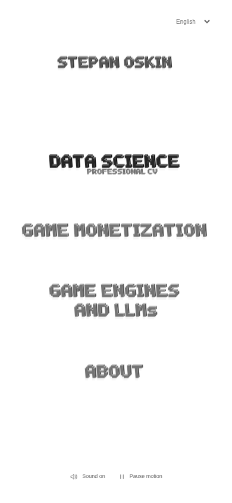

# Stepanoskin block launcher — refinement review

3 October 2026. Scope: `/stepanoskin` in `apps/lab`.

## Owner direction implemented

The latest [design guidelines](DESIGN_GUIDELINES.md) supersede the first pastel
interpretation and strongly rotated pixel-grid draft.

The page is almost empty white, with one middle column of original procedural
block lettering. Stepan Oskin appears at the top with a slight tonal emphasis.
DATA SCIENCE is the darkest navigation choice; professional CV is a smaller
layer beneath and slightly behind it. GAME MONETIZATION, GAME ENGINES AND LLMs,
and ABOUT have the same secondary treatment. The long engines label occupies
two centered lines. The existing destinations remain unchanged.

A denser original alphabet now has solid joined fronts, exposed top/side faces,
small edge highlights and a restrained silhouette shadow. Baselines are level;
all depth uses the same extrusion. A shared scale keeps the main block sizes
consistent across choices at each viewport. The CV clarification uses the same
geometry at a smaller scale.

## Motion and delivery

- Bounded CSS word float, staggered hover/focus lift, 170ms selection impact.
- Existing owner-supplied selection clang; hover/focus are silent. Sound is
  loaded only on an enabled activation and its decay survives navigation.
- Shared persistent sound/motion preferences; OS reduced motion disables
  movement and removes the selection delay. Real links preserve modified clicks.
- One intersection observer pauses each offscreen floating group. Hidden-page
  visibility pauses all animations. Listeners and pending navigation are cleaned up.
- Geometry is computed once from small original masks, with aggregated paths;
  no per-cube DOM, canvas, WebGL, per-frame React updates or new dependencies.
- No image or new font payload. Project readers are not prefetched by the menu.
- English geometric labels follow the owner's requested wording. Six-language
  accessible names, controls and hover/focus supporting labels retain the locale
  cookie; this is not a six-language geometric alphabet.

## Validation

- 40 Jest suites / 178 tests pass after integrating the latest main branch with the required API setting and two workers.
  New tests cover one-shot selection, the short delay, immediate paused-motion
  navigation and cancellation on unmount.
- Production build and TypeScript pass; retained asset releases validate.
- Targeted ESLint and whitespace checks pass.
- Desktop and phone screenshots were inspected for typography, hierarchy and
  placement of the professional-CV clarification. Browser error list was empty.
- At 1440, 768, 390 and 320px: no horizontal overflow; all controls meet 44 × 44px;
  Axe WCAG 2 A/AA and 2.1 AA checks find no violations. Six locales fit at 320px.
- All four destination routes work, including keyboard selection and Back.
  Persistent pause, per-group offscreen suspension, simulated hidden-page
  suspension and OS reduced motion pass. Browser errors: none.
- Detailed evidence is in `review/browser-checks.json`. The warm local load
  measured LCP/FCP 268ms, TTFB 51.6ms and CLS 0; resource payload was 316,316
  encoded bytes including existing framework/fonts, with zero image requests.
  A fresh browser session measured LCP/FCP 228ms, TTFB 61ms and CLS 0.

Performance figures in the browser report are unthrottled localhost laboratory
observations. Field Web Vitals and actual mobile hardware performance remain
unmeasured. No new telemetry is introduced.

## Scope and delivery

Only the launcher, its tests, its design/review documents and related memory
pointers change. About, the CV itself, Sanctuary content, Loopforge content,
backend contracts and other apps retain their separate implementations.
The memory pointers make the owner's current design requirements discoverable.

Branch: `codex/stepanoskin-airy-launcher`, integrated with `origin/master` at `03f11a3`.
The only integration conflicts were the two memory introductions; both workstreams’
notes are retained. Browser evidence was captured before integration, with identical
launcher code.
The isolated worktree preserves the main checkout's ongoing Sanctuary work.
This is a draft visual iteration, not a production rollout or a claim of owner
approval. Merging will affect the live Lab deployment.
